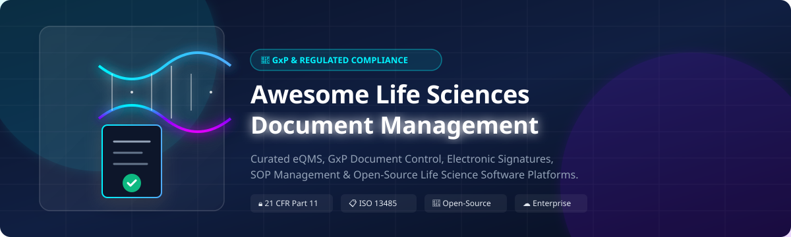
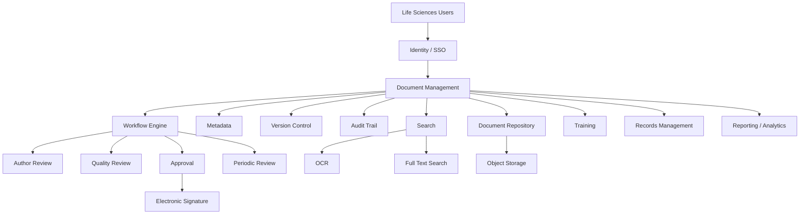
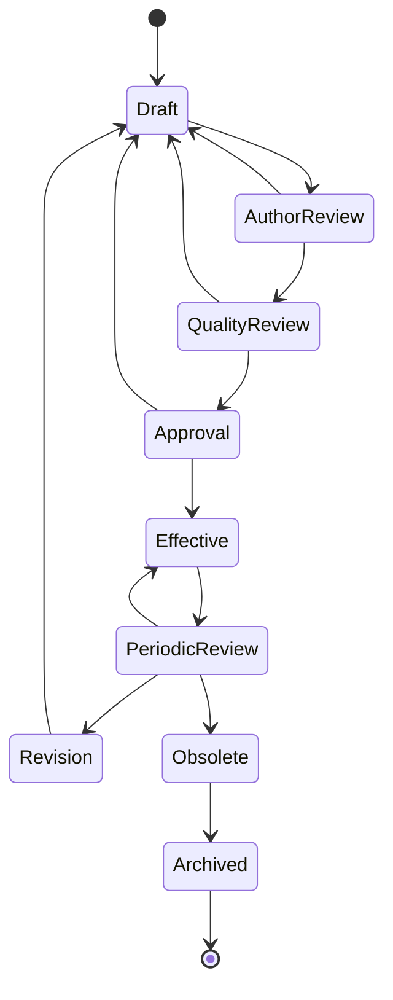
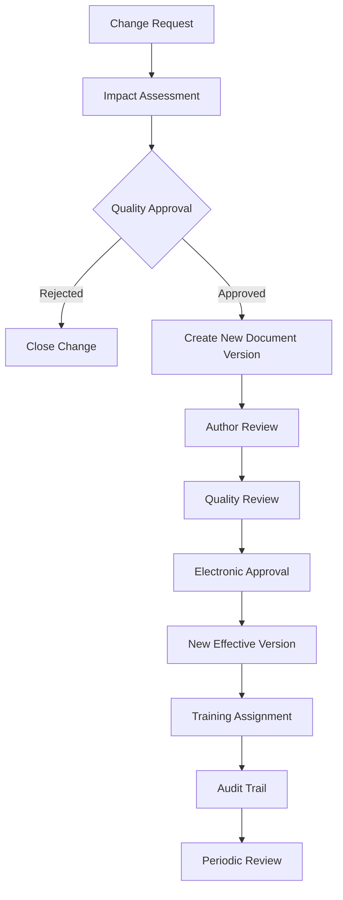
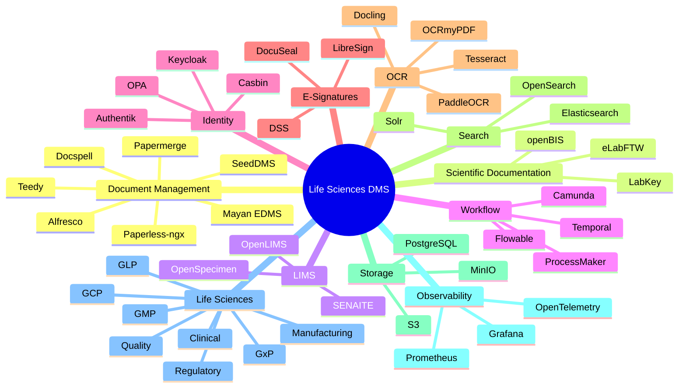

# 🧬 Awesome Life Sciences Document Management 🔬

<a href="https://github.com/ishandutta2007/Awesome-Awesome-Awesome"></a><a href="https://discord.gg/jc4xtF58Ve"></a> <a href="https://github.com/ishandutta2007"></a>

> 📑 A curated list of **Life Sciences Document Management Systems (DMS), GxP document control platforms, 21 CFR Part 11 regulated content management systems, electronic quality management systems (eQMS) and open-source software** for pharmaceutical, biotechnology, medical-device, CROs, diagnostics and regulated life-science organizations. 🚀

Life Sciences Document Management sits at the intersection of **Enterprise Content Management (ECM), Document Management, Quality Management (QMS) and GxP compliance** (including FDA 21 CFR Part 11, EU Annex 11, and ISO 13485). 📊

Typical capabilities include: ⚙️

* 📄 **Controlled documents**
* 📜 **SOP management**
* 📝 **Work instructions**
* 📑 **Policies and procedures**
* ✍️ **Document authoring**
* 🔀 **Version control**
* 🔄 **Review and approval workflows**
* ✒️ **Electronic signatures** (21 CFR Part 11 compliant)
* 📜 **Audit trails** & history
* 🖨️ **Controlled copies** & print controls
* 📅 **Effective-date management**
* ⏳ **Periodic review**
* 🎓 **Training assignment**
* 🛠️ **Change control**
* 🗑️ **Document obsolescence & archiving**
* 📋 **Quality records** & CAPA
* 📤 **Regulatory submissions** (eCTD)
* 🧪 **Clinical documentation** (eTMF)
* 🏭 **Manufacturing documentation** (eBR / Batch Records)
* 🤝 **Supplier documentation**
* 🛡️ **Inspection readiness**

This repository focuses primarily on **open-source and self-hostable building blocks**, while maintaining a comprehensive catalog of commercial SaaS platforms such as Veeva Vault QualityDocs, MasterControl Documents, OpenText Documentum, Qualio, Scilife, Sparta TrackWise, ComplianceQuest, Dot Compliance, Ennov DMS and AMPLEXOR. 🌐

> **Important Note:** ⚠️ There is no single widely adopted open-source drop-in replacement for a fully validated commercial GxP DMS such as Veeva QualityDocs or MasterControl. Instead, an open-source implementation generally combines a document-management platform with workflow, identity, audit logging, electronic signatures, records management, quality processes and computer software assurance (CSA) / Computer System Validation (CSV) controls. 💡

---

## 📑 Table of Contents 📌

* [☁️ SaaS / Hosted Commercial Platforms](#️-saashosted-platforms)
* [🌍 Open-Source Ecosystem](#-open-source)
* [📚 Open-Source Document Management Systems](#-open-source-document-management-systems)
* [🧬 Open-Source Life Sciences & Laboratory Platforms](#-open-source-life-sciences--laboratory-platforms)
* [🧪 Open-Source ELN / Research Documentation](#-open-source-eln--research-documentation)
* [🗂️ Open-Source Enterprise Content Management](#️-open-source-enterprise-content-management)
* [🔄 Open-Source Workflow & Approval Engines](#-open-source-workflow--approval)
* [✍️ Open-Source Electronic Signatures](#️-open-source-electronic-signatures)
* [🔐 Open-Source Identity & Access Control](#-open-source-identity--access-control)
* [📜 Open-Source Audit & Records Management](#-open-source-audit--records-management)
* [🔎 Open-Source OCR & Document Processing](#-open-source-ocr--document-processing)
* [🧬 Open-Source Scientific Data Management](#-open-source-scientific-data-management)
* [🧩 Commercial Platform → Open-Source Equivalent](#-commercial-platform--open-source-equivalent)
* [🏗️ Life Sciences DMS Architecture](#️-life-sciences-dms-architecture)
* [🔄 Open-Source GxP Document Architecture](#-open-source-gxp-document-architecture)
* [📝 Controlled Document Lifecycle](#-controlled-document-lifecycle)
* [⚖️ Commercial vs Open-Source](#️-commercial-vs-open-source)
* [🚀 Recommended Open-Source Stacks](#-recommended-open-source-stacks)
* [📊 Document Management Technology Comparison](#-document-management-technology-comparison)
* [🎯 Recommended Projects by Use Case](#-recommended-projects-by-use-case)
* [🏢 Building a Veeva QualityDocs Alternative](#-building-a-veeva-qualitydocs-alternative)
* [🧪 Building an Open-Source eQMS Document Module](#-building-an-open-source-eqms-document-module)
* [🌐 Open-Source Life Sciences Document Landscape](#-open-source-life-sciences-document-landscape)
* [🧠 Why Open-Source Life Sciences DMS Matters](#-why-open-source-life-sciences-dms-matters)
* [🤝 Contributing](#-contributing)
* [⚠️ Disclaimer](#️-disclaimer)

---

# ☁️ SaaS/Hosted Platforms

Commercial Life Sciences DMS and eQMS platforms combine document management with regulated workflows, audit trails, electronic signatures, quality processes and validation support. 💼

### 📈 Market Size & Industry Structure Analysis

> 💡 **Market Size & Fragment Concentration:** The global Life Sciences Quality Management Software (eQMS) and Regulated Document Management market is estimated at **$3.2 Billion USD to $3.8 Billion USD** (2025/2026), expanding at a CAGR of ~11.5%. The market is **moderately fragmented**, with a dominant enterprise leader (**Veeva Systems**) holding significant market share in pharma/biotech enterprise, while specialized cloud platforms (**MasterControl, Greenlight Guru, Qualio, ETQ/Hexagon**) compete intensely across mid-market biotech, medical devices, and CRO sectors. 📊

| Platform | Company | Market Valuation / Revenue (Desc) 🏢 | Pricing (Starting Tier) 💵 | Free Tier / Trial Limit ⏳ | Primary Focus 🎯 | Key Capabilities ⚙️ |
| :--- | :--- | :--- | :--- | :--- | :--- | :--- |
| [TrackWise Digital](https://www.sparta-systems.com/) | Sparta Systems / Honeywell | **$65 Billion Market Cap** ($37.4B Revenue) | $150 / user / month (Enterprise Quote) | 14-day guided trial upon demo approval | Enterprise QMS | Document control, CAPA, change control, quality processes |
| [OpenText Documentum](https://www.opentext.com/products/documentum-content-management-for-life-sciences) | OpenText | **$8.5 Billion Market Cap** ($5.8B Revenue) | $120 / user / month (Enterprise License) | 30-day enterprise evaluation environment | Enterprise Content Management | GxP content, clinical, regulatory, quality and manufacturing content |
| [Veeva Vault QualityDocs](https://www.veeva.com/products/veeva-qualitydocs/) | Veeva Systems | **$34 Billion Market Cap** ($2.7B Revenue) | $180 / user / month (Annual Contract) | 14-day trial upon executive consultation | GxP Content Management | SOPs, controlled documents, workflows, approvals, audit trails, training |
| [Veeva Vault QMS](https://www.veeva.com/products/vault-qms/) | Veeva Systems | **$34 Billion Market Cap** ($2.7B Revenue) | $220 / user / month (Enterprise Suite) | 14-day trial upon executive consultation | Enterprise Quality Management | Quality events, CAPA, change control and document-centric quality |
| [ETQ Reliance](https://www.etq.com/) | ETQ / Hexagon | **$22 Billion Valuation** (Hexagon Parent) | $90 / user / month (Billed Annually) | 14-day sandbox access upon qualification | Enterprise QMS | Document control, CAPA, audits and training |
| [MasterControl Documents](https://www.mastercontrol.com/) | MasterControl | **$1.3 Billion Valuation** ($150M+ ARR) | $110 / user / month (Growth Tier) | 14-day full platform trial after demo | Quality Document Management | Document control, workflows, electronic signatures, training, audit readiness |
| [MasterControl Quality Excellence](https://www.mastercontrol.com/quality-management-software/) | MasterControl | **$1.3 Billion Valuation** ($150M+ ARR) | $140 / user / month (Suite Tier) | 14-day full platform trial after demo | eQMS | Documents, training, CAPA, change control and audits |
| [Greenlight Guru](https://www.greenlight.guru/) | Greenlight Guru | **$600 Million Valuation** ($50M+ ARR) | $350 / month (Starter Team Tier) | 14-day interactive trial after walkthrough | Medical-Device QMS | Design controls, document management, CAPA and quality processes |
| [Qualio](https://www.qualio.com/) | Qualio | **$250 Million Valuation** ($30M+ ARR) | $490 / month (Growth Plan up to 10 users) | 14-day free trial with demo data | Life Sciences QMS | Document control, training, quality workflows and compliance |
| [ComplianceQuest](https://www.compliancequest.com/) | ComplianceQuest | **$180 Million Valuation** ($25M+ ARR) | $65 / user / month (Salesforce Platform) | 14-day test drive sandbox on AppExchange | QMS / EHS / Compliance | Controlled documents, workflows, audit management, CAPA and compliance |
| [AMPLEXOR](https://www.amplexor.com/) | AMPLEXOR / Acolad | **$150 Million Valuation** ($120M Revenue) | $85 / user / month (Managed Tenant) | 30-day proof-of-concept tenant | Regulated Content Management | Document management, regulatory content, localization and compliance |
| [Dot Compliance](https://www.dotcompliance.com/) | Dot Compliance | **$120 Million Valuation** ($20M+ ARR) | $75 / user / month (Ready eQMS Tier) | 14-day instant cloud sandbox trial | Cloud eQMS | Document management, training, quality workflows and compliance |
| [Ennov DMS](https://www.ennov.com/) | Ennov | **$90 Million Valuation** ($35M Revenue) | $70 / user / month (Standard Regulated) | 14-day trial tenant upon request | Life Sciences Content Management | Document management, workflows, regulatory and quality content |
| [QT9 QMS](https://qt9qms.com/) | QT9 | **$45 Million Valuation** ($12M Revenue) | $45 / user / month (Module Pack) | 30-day free trial (Full Access) | Quality Management | Document control, CAPA, training and audits |
| [Scilife](https://www.scilife.io/) | Scilife | **$35 Million Valuation** ($8M Revenue) | $350 / month (Starter Pack up to 5 users) | 14-day free trial (No Credit Card required) | Life Sciences QMS | Document management, training, quality and compliance |
| [SimplerQMS](https://www.simplerqms.com/) | SimplerQMS | **$25 Million Valuation** ($5M Revenue) | $55 / user / month (All-in-One Cloud) | 14-day guided trial environment | Cloud QMS | Document control, training, CAPA, change management |
| [Qualsys](https://www.qualsys.co.uk/) | Qualsys / Ideagen | **$20 Million Valuation** ($8M Revenue) | $50 / user / month (Module Tier) | 14-day evaluation environment | Quality Management | Document control, quality workflows, training and audits |

Veeva describes QualityDocs as a regulated quality-content-management solution that manages content through its lifecycle, including procedures, policies, work instructions, quality agreements and batch-related documentation. 📄

OpenText similarly positions Documentum Content Management for Life Sciences around GxP-compliant content spanning clinical, regulatory, quality and manufacturing domains, with audit trails, e-signatures and controlled workflows. 🛡️

---

# 🌍 Open-Source

The open-source ecosystem is broader than simply "open-source Veeva." 🧬

A complete open implementation can be assembled from several layers:

```text
                         LIFE SCIENCES DMS
                                │
        ┌───────────────────────┼────────────────────────┐
        │                       │                        │
        ▼                       ▼                        ▼
   Document DMS            Workflow Engine          Identity
        │                       │                        │
        ▼                       ▼                        ▼
   Mayan EDMS             Camunda / Temporal        Keycloak
   Alfresco               ProcessMaker
   Paperless-ngx
        │
        ├──────────────────────────────────────────────┐
        ▼                                              ▼
   Audit / Records                              E-Signatures
        │                                              │
        ▼                                              ▼
   PostgreSQL / Logs                            Signature Service
        │
        ▼
   OCR / Search / Metadata
```

The strongest open-source options are generally **component platforms**, rather than turnkey validated GxP products. 🧩

---

# 📚 Open-Source Document Management Systems

## ⭐ Mayan EDMS

[Mayan EDMS](https://gitlab.com/mayan-edms/mayan-edms) is one of the most relevant open-source DMS projects for building a self-hosted controlled-document environment. 📄

Capabilities include:
* Document management
* Metadata indexing
* Versioning & Revision controls
* OCR document processing
* Document workflows & approval chains
* Access control (ACL / RBAC)
* Digital-signature verification
* Document types & custom attributes
* Tags & Smart Categories
* Full-text search
* Audit-oriented event logs

The project describes itself as a free and open-source enterprise-grade electronic document management system, with document controls, workflows and self-hosting capabilities. 🔒

| Project | GitHub_Stars ⭐ | Primary Role 🎯 | Open Source / License 📜 |
| :--- | :--- | :--- | :---: |
| [Paperless-ngx](https://github.com/paperless-ngx/paperless-ngx) | [](https://github.com/paperless-ngx/paperless-ngx/stargazers) | Document archive / OCR / DMS | ✅ GPLv3 |
| [DocuSeal](https://github.com/docusealco/docuseal) | [](https://github.com/docusealco/docuseal/stargazers) | Document signing & execution | ✅ MIT |
| [Alfresco Community Edition](https://github.com/Alfresco/alfresco-community-repo) | [](https://github.com/Alfresco/alfresco-community-repo/stargazers) | Enterprise content management | ✅ LGPLv3 |
| [Nuxeo](https://github.com/nuxeo/nuxeo) | [](https://github.com/nuxeo/nuxeo/stargazers) | Content management platform | ⚠️ See licensing |
| [Docspell](https://github.com/eikek/docspell) | [](https://github.com/eikek/docspell/stargazers) | Organizational DMS & processing | ✅ AGPLv3 |
| [Teedy](https://github.com/sismics/docs) | [](https://github.com/sismics/docs/stargazers) | Lightweight document management | ✅ GPLv3 |
| [Papermerge](https://github.com/papermerge/papermerge-core) | [](https://github.com/papermerge/papermerge-core/stargazers) | Document management & OCR | ✅ Apache 2.0 |
| [Mayan EDMS](https://gitlab.com/mayan-edms/mayan-edms) | [](https://github.com/mayan-edms/Mayan-EDMS/stargazers) | Enterprise GxP-ready DMS | ✅ Apache 2.0 |
| [LogicalDOC Community](https://github.com/logicaldoc/community) | [](https://github.com/logicaldoc/community/stargazers) | Enterprise DMS | ⚠️ See licensing |
| [SeedDMS](https://github.com/seedDMS/SeedDMS) | [](https://github.com/seedDMS/SeedDMS/stargazers) | Traditional enterprise DMS | ✅ GPLv2 |
| [OpenKM](https://github.com/openkm/document-management-system) | [](https://github.com/openkm/document-management-system/stargazers) | DMS | ⚠️ CE is binary-only (7+) |
| [OpenDocMan](https://github.com/opendocman/opendocman) | [](https://github.com/opendocman/opendocman/stargazers) | Lightweight document management | ✅ GPLv2 |

### Important OpenKM Licensing Note ⚠️

OpenKM should **not** be treated as a straightforward current open-source alternative.

Its repository states that versions prior to 7.0 retain GPLv2 source availability, while from version 7.0 the Community Edition is distributed as a free binary without source code.

Therefore:

```text
OpenKM ≤ 6.x
    → Historical GPL source

OpenKM 7+
    → Free Community binary
    → Not equivalent to current source-available OSS
```

---

# 📂 Open-Source Document Management Comparison 📊

| Project | DMS | Versioning | OCR | Workflow | Audit Features | Self-Host |
| :--- | :---: | :---: | :---: | :---: | :---: | :---: |
| **Mayan EDMS** | ✅ | ✅ | ✅ | ✅ | ✅ | ✅ |
| **Alfresco CE** | ✅ | ✅ | ⚠️ | ✅ | ✅ | ✅ |
| **Paperless-ngx** | ✅ | ✅ | ✅ | ⚠️ | ✅ | ✅ |
| **Docspell** | ✅ | ✅ | ✅ | ⚠️ | ⚠️ | ✅ |
| **Teedy** | ✅ | ✅ | ✅ | ⚠️ | ⚠️ | ✅ |
| **Papermerge** | ✅ | ✅ | ✅ | ⚠️ | ⚠️ | ✅ |
| **SeedDMS** | ✅ | ✅ | ⚠️ | ✅ | ✅ | ✅ |
| **OpenDocMan** | ✅ | ✅ | ⚠️ | ⚠️ | ⚠️ | ✅ |

Paperless-ngx includes document history/audit logging, while its documentation specifically warns that certain PDF modifications can invalidate existing digital signatures. 🛡️

---

# 🧬 Open-Source Life Sciences & Laboratory Platforms

Life Sciences document control often needs to connect to: 🧪
* ELNs (Electronic Lab Notebooks)
* LIMS (Laboratory Information Management Systems)
* Sample management
* Laboratory equipment & instruments
* Research records & protocols
* Quality management systems (eQMS)
* Scientific datasets & bio-repositories

Useful open-source projects (sorted by GitHub_Stars_Count): ⭐

| Project | GitHub_Stars ⭐ | Primary Focus 🎯 | Relevance 💡 |
| :--- | :--- | :--- | :--- |
| [Nextflow](https://github.com/nextflow-io/nextflow) | [](https://github.com/nextflow-io/nextflow/stargazers) | Scientific workflow execution | Reproducible scientific data pipelines |
| [Galaxy](https://github.com/galaxyproject/galaxy) | [](https://github.com/galaxyproject/galaxy/stargazers) | Scientific workflow platform | Bioinformatics & computational analysis |
| [OpenRefine](https://github.com/OpenRefine/OpenRefine) | [](https://github.com/OpenRefine/OpenRefine/stargazers) | Data cleaning & transformation | Scientific dataset curation & validation |
| [eLabFTW](https://github.com/elabftw/elabftw) | [](https://github.com/elabftw/elabftw/stargazers) | Electronic laboratory notebook | Controlled experiment research records |
| [LabKey Server](https://github.com/LabKey/platform) | [](https://github.com/LabKey/platform/stargazers) | Scientific data management | Clinical trial & observational data |
| [SENAITE](https://github.com/senaite/senaite.core) | [](https://github.com/senaite/senaite.core/stargazers) | Enterprise LIMS platform | Regulated lab testing & sample management |
| [OpenSpecimen](https://github.com/krishagni/openspecimen) | [](https://github.com/krishagni/openspecimen/stargazers) | Biospecimen management | Biobanking & specimen tracking |
| [openBIS](https://openbis.ch/) | N/A (GitLab hosted) | Scientific data management | Multi-omics research & metadata tracking |
| [openLIMS](https://github.com/Open-LIMS) | [](https://github.com/Open-LIMS/Open-LIMS/stargazers) | Laboratory information management | LIMS ecosystem building blocks |

---

# 🧪 Open-Source ELN / Research Documentation

## eLabFTW

[eLabFTW](https://github.com/elabftw/elabftw) is a major open-source electronic lab notebook for research teams. 🔬

Features include:
* Experimental records & protocols
* Resource databases & inventory
* Reagents & compound tracking
* Equipment scheduling
* Cell lines & biospecimens
* File attachments & PDF generation
* Advanced permissions & RBAC
* REST API integration
* Trusted timestamping (RFC 3161)
* Scientific file format preview
* Audit trail functionality
* Dockerized self-hosting

The project explicitly describes itself as a secure electronic lab notebook and supports multi-team installations, REST APIs, advanced permissions and timestamping. 🛡️

It is particularly relevant when a Life Sciences DMS needs to manage the relationship between:

```text
Experiment
   │
   ├── Raw Data
   ├── Protocol
   ├── Results
   ├── Reagents
   ├── Equipment
   └── Researcher
```

and controlled organizational documentation.

---

## openBIS

[openBIS](https://openbis.ch/) provides open scientific data-management infrastructure developed by ETH Zurich. 🧬

It is useful for:
* Research data repository
* Scientific metadata management
* Sample & inventory tracking
* Experimental dataset management
* Data organization & FAIR principles
* Scientific workflows

---

## SENAITE

[SENAITE](https://github.com/senaite/senaite.core) is an open-source LIMS platform built on Plone. 🧪

It can complement a DMS by connecting controlled documentation to:

```text
Samples
  │
  ▼
Tests
  │
  ▼
Results
  │
  ▼
Laboratory Records
  │
  ▼
Controlled Documents
```

---

# 🗂️ Open-Source Enterprise Content Management

| Project | GitHub_Stars ⭐ | Strength 🎯 |
| :--- | :--- | :--- |
| [Paperless-ngx](https://github.com/paperless-ngx/paperless-ngx) | [](https://github.com/paperless-ngx/paperless-ngx/stargazers) | Document archive & OCR ingestion |
| [Alfresco Community](https://github.com/Alfresco/alfresco-community-repo) | [](https://github.com/Alfresco/alfresco-community-repo/stargazers) | Enterprise content management & CMIS |
| [Nuxeo](https://github.com/nuxeo/nuxeo) | [](https://github.com/nuxeo/nuxeo/stargazers) | Content services & metadata framework |
| [Docspell](https://github.com/eikek/docspell) | [](https://github.com/eikek/docspell/stargazers) | Searchable organizational DMS |
| [Teedy](https://github.com/sismics/docs) | [](https://github.com/sismics/docs/stargazers) | Lightweight document management |
| [Papermerge](https://github.com/papermerge/papermerge-core) | [](https://github.com/papermerge/papermerge-core/stargazers) | OCR-centric document manager |
| [Mayan EDMS](https://gitlab.com/mayan-edms/mayan-edms) | [](https://github.com/mayan-edms/Mayan-EDMS/stargazers) | Controlled document & workflow management |
| [SeedDMS](https://github.com/seedDMS/SeedDMS) | [](https://github.com/seedDMS/SeedDMS/stargazers) | Traditional PHP document control |

For a regulated environment, enterprise content platforms such as Alfresco or Mayan EDMS generally provide a more useful starting point than consumer-oriented document archives. 🏢

---

# 🔄 Open-Source Workflow & Approval

Controlled documents require rigorous lifecycle workflows. ⚙️

Typical lifecycle:

```text
Draft
  │
  ▼
Author Review
  │
  ▼
Quality Review
  │
  ▼
Approval
  │
  ▼
Effective
  │
  ▼
Periodic Review
  │
  ├───────────────┐
  │               │
  ▼               ▼
Revision       Obsolete
  │
  ▼
New Version
```

Useful workflow engines (sorted by GitHub_Stars_Count): ⭐

| Project | GitHub_Stars ⭐ | Workflow Capability 🎯 |
| :--- | :--- | :--- |
| [Apache Airflow](https://github.com/apache/airflow) | [](https://github.com/apache/airflow/stargazers) | Data workflow & ETL orchestration |
| [n8n](https://github.com/n8n-io/n8n) | [](https://github.com/n8n-io/n8n/stargazers) | Low-code workflow automation |
| [Temporal](https://github.com/temporalio/temporal) | [](https://github.com/temporalio/temporal/stargazers) | Durable stateful workflow orchestration |
| [Camunda 8 / 7](https://github.com/camunda/camunda) | [](https://github.com/camunda/camunda/stargazers) | BPMN 2.0 / GxP workflow automation |
| [Flowable](https://github.com/flowable/flowable-engine) | [](https://github.com/flowable/flowable-engine/stargazers) | BPMN / CMMN case & workflow engine |
| [ProcessMaker](https://github.com/ProcessMaker/processmaker) | [](https://github.com/ProcessMaker/processmaker/stargazers) | Business process automation |
| [Mayan EDMS](https://gitlab.com/mayan-edms/mayan-edms) | [](https://github.com/mayan-edms/Mayan-EDMS/stargazers) | Built-in document workflow states |

For regulated document control, BPMN-oriented platforms such as Camunda or Flowable can be useful for implementing explicit approval-state machines. 🔄

---

# ✍️ Open-Source Electronic Signatures

Electronic signatures are a critical component of 21 CFR Part 11 and EU Annex 11 regulated document workflows. ✒️

Potential building blocks (sorted by GitHub_Stars_Count): ⭐

| Project | GitHub_Stars ⭐ | Role 🎯 |
| :--- | :--- | :--- |
| [Nextcloud](https://github.com/nextcloud/server) | [](https://github.com/nextcloud/server/stargazers) | Collaboration platform with signature integrations |
| [DocuSeal](https://github.com/docusealco/docuseal) | [](https://github.com/docusealco/docuseal/stargazers) | Self-hosted document signing platform |
| [LibreSign](https://github.com/LibreSign/libresign) | [](https://github.com/LibreSign/libresign/stargazers) | Electronic signature app for Nextcloud |
| [DSS (Digital Signature Services)](https://github.com/esig/dss) | [](https://github.com/esig/dss/stargazers) | EU eIDAS compliant digital signature framework |
| [Open eSignForms](https://github.com/mihaip/openesignforms) | [](https://github.com/mihaip/openesignforms/stargazers) | Electronic forms & signature processing |
| [OpenSignature](https://github.com/OpenSignature) | N/A | Open-source signature ecosystem |

### Important Distinction ⚠️

A cryptographic digital signature and a **regulated electronic signature process (21 CFR Part 11)** are not automatically equivalent.

A GxP environment also requires:

```text
Identity Verification
        +
Authentication (2-Factor / Password Re-entry)
        +
Signature Intent (e.g., Author, Reviewer, Approver)
        +
Signature Meaning & Timestamp
        +
Immutable Audit Trail
        +
Record Binding
        +
Access Controls & Validation
```

---

# 🔐 Open-Source Identity & Access Control

A controlled-document system needs granular access control (RBAC / ABAC) and 21 CFR Part 11 compliant re-authentication. 🔑

Useful projects (sorted by GitHub_Stars_Count): ⭐

| Project | GitHub_Stars ⭐ | Role 🎯 |
| :--- | :--- | :--- |
| [Keycloak](https://github.com/keycloak/keycloak) | [](https://github.com/keycloak/keycloak/stargazers) | Enterprise Identity Provider / SSO / OAuth2 / RBAC |
| [Open Policy Agent (OPA)](https://github.com/open-policy-agent/opa) | [](https://github.com/open-policy-agent/opa/stargazers) | Declarative policy & authorization engine |
| [Casbin](https://github.com/casbin/casbin) | [](https://github.com/casbin/casbin/stargazers) | Fine-grained access control library |
| [Authentik](https://github.com/goauthentik/authentik) | [](https://github.com/goauthentik/authentik/stargazers) | Open-source Identity Provider with flow builder |
| [Authelia](https://github.com/authelia/authelia) | [](https://github.com/authelia/authelia/stargazers) | Lightweight authentication & 2FA portal |
| [Dex](https://github.com/dexidp/dex) | [](https://github.com/dexidp/dex/stargazers) | OpenID Connect identity federation engine |

A regulated DMS architecture:

```text
Keycloak
   │
   ├── Single Sign-On (SSO)
   ├── Multi-Factor Authentication (MFA)
   ├── Roles & Permissions
   ├── Group Policies
   └── Identity Federation (Active Directory / LDAP)
        │
        ▼
    DMS / QMS Platform
```

---

# 📜 Open-Source Audit & Records Management

A Life Sciences DMS needs complete ALCOA+ data integrity and traceability. 🛡️

Important events tracked in audit trail:

```text
Document Created
      │
      ▼
Document Modified
      │
      ▼
Version Created
      │
      ▼
Review Started
      │
      ▼
Reviewer Action
      │
      ▼
Approval & E-Signature
      │
      ▼
Effective Date
      │
      ▼
Training Assignment
      │
      ▼
Periodic Review
      │
      ▼
Revision / Obsolescence
```

Useful infrastructure building blocks: ⚙️

| Technology | Purpose 🎯 |
| :--- | :--- |
| **PostgreSQL** | ACID-compliant relational transactional records |
| **OpenSearch** | Distributed audit log analysis & full-text search |
| **Elasticsearch** | Enterprise search & log management |
| **Loki** | Log aggregation & audit trail indexing |
| **Grafana** | Compliance monitoring & audit dashboards |
| **Prometheus** | Metric collection & system health tracking |
| **OpenTelemetry** | Distributed tracing across GxP microservices |
| **WORM Storage** | Write Once Read Many immutable records retention |
| **MinIO** | S3-compatible self-hosted object storage with retention locks |

---

# 🔎 Open-Source OCR & Document Processing

Controlled documents often originate as scanned paper records, certificates of analysis, or legacy PDFs. 📄

Useful projects (sorted by GitHub_Stars_Count): ⭐

| Project | GitHub_Stars ⭐ | Primary Function 🎯 |
| :--- | :--- | :--- |
| [Tesseract](https://github.com/tesseract-ocr/tesseract) | [](https://github.com/tesseract-ocr/tesseract/stargazers) | Open-source optical character recognition engine |
| [PaddleOCR](https://github.com/PaddlePaddle/PaddleOCR) | [](https://github.com/PaddlePaddle/PaddleOCR/stargazers) | Multilingual OCR & document parsing toolkit |
| [Unstructured](https://github.com/Unstructured-IO/unstructured) | [](https://github.com/Unstructured-IO/unstructured/stargazers) | Document ingestion & parsing for AI/LLM pipelines |
| [PyMuPDF](https://github.com/pymupdf/PyMuPDF) | [](https://github.com/pymupdf/PyMuPDF/stargazers) | High-performance PDF processing & text extraction |
| [Docling](https://github.com/DS4SD/docling) | [](https://github.com/DS4SD/docling/stargazers) | Advanced document parsing & layout understanding |
| [Surya](https://github.com/VikParuchuri/surya) | [](https://github.com/VikParuchuri/surya/stargazers) | Document OCR, line detection & layout analysis |
| [OCRmyPDF](https://github.com/ocrmypdf/OCRmyPDF) | [](https://github.com/ocrmypdf/OCRmyPDF/stargazers) | Adds searchable OCR text layers to PDF documents |
| [Apache Tika](https://github.com/apache/tika) | [](https://github.com/apache/tika/stargazers) | Enterprise content analysis & metadata extraction |

Example pipeline:

```text
Scanned Batch Record / SOP
    │
    ▼
OCRmyPDF / PaddleOCR
    │
    ▼
Searchable Text Layer
    │
    ▼
Metadata Extraction (Docling / Tika)
    │
    ▼
DMS Repository (Mayan EDMS)
    │
    ▼
Full-Text Search & Audit Index
```

---

# 🧬 Open-Source Scientific Data Management

Document management in Life Sciences intersects directly with raw scientific data management. 🧪

| Project | Area 🎯 |
| :--- | :--- |
| **openBIS** | Scientific data & metadata management framework |
| **eLabFTW** | Electronic Lab Notebook (ELN) |
| **SENAITE** | Laboratory Information Management System (LIMS) |
| **OpenSpecimen** | Biobank & biospecimen management system |
| **LabKey Server** | Observational & clinical scientific data platform |
| **Galaxy** | Reproducible bioinformatics workflow system |
| **Nextflow** | Scalable scientific pipeline orchestrator |

Integrated Architecture:

```text
                  Research
                     │
        ┌────────────┼────────────┐
        ▼            ▼            ▼
       ELN          LIMS       Scientific Data
        │            │            │
        └────────────┼────────────┘
                     ▼
               Document System
                     │
                     ▼
                Quality System
```

---

# 🧩 Commercial Platform → Open-Source Equivalent

| Commercial Platform | Open-Source Equivalent / Building Blocks |
| :--- | :--- |
| **Veeva Vault QualityDocs** | Mayan EDMS + Camunda/Flowable + Keycloak + PostgreSQL + electronic-signature layer |
| **MasterControl Documents** | Mayan EDMS + workflow engine + Keycloak + audit infrastructure |
| **OpenText Documentum Life Sciences** | Alfresco CE / Mayan EDMS + workflow + records management + OpenSearch |
| **Qualio** | Mayan EDMS + workflow + Keycloak + e-signature + training module |
| **Scilife** | Mayan EDMS + eLabFTW + workflow + identity + audit infrastructure |
| **Sparta TrackWise** | Mayan EDMS + Camunda + PostgreSQL + quality-process modules |
| **ComplianceQuest** | Mayan EDMS + workflow + ERP/QMS modules + Keycloak |
| **Dot Compliance** | Mayan EDMS + workflow + e-signature + audit layer |
| **Ennov DMS** | Mayan EDMS / Alfresco + workflow + records management |
| **AMPLEXOR** | Alfresco + OpenSearch + workflow + localization/content tooling |
| **Veeva QualityDocs + ELN** | Mayan EDMS + eLabFTW + workflow + identity |
| **Documentum + LIMS** | Alfresco + SENAITE + OpenSearch |
| **Life Sciences DMS** | Mayan EDMS + Camunda + Keycloak + PostgreSQL |
| **GxP Document Control** | Mayan EDMS + workflow + audit log + e-signature |
| **Regulated Content Repository** | Alfresco + OpenSearch + MinIO + Keycloak |

---

# 🏗️ Life Sciences DMS Architecture



---

# 🔄 Open-Source GxP Document Architecture

```text
                       LIFE SCIENCES USER
                              │
                              ▼
                         KEYCLOAK / SSO
                              │
                              ▼
                     ┌───────────────────┐
                     │    MAYAN EDMS     │
                     │ / ALFRESCO / DMS  │
                     └─────────┬─────────┘
                               │
            ┌──────────────────┼──────────────────┐
            ▼                  ▼                  ▼
       Document Store      Metadata           Versioning
            │                  │                  │
            └──────────────────┼──────────────────┘
                               ▼
                        WORKFLOW ENGINE
                         Camunda / Flowable
                               │
              ┌────────────────┼────────────────┐
              ▼                ▼                ▼
           Review           Approval         Training
              │                │
              └────────────────┘
                       │
                       ▼
                 E-SIGNATURE
                       │
                       ▼
                  AUDIT TRAIL
                       │
                       ▼
                RECORDS RETENTION
```

---

# 📝 Controlled Document Lifecycle

A typical controlled-document lifecycle can be represented as:



Typical document states:

```text
Draft
  ↓
In Review
  ↓
Quality Review
  ↓
Approved
  ↓
Effective
  ↓
Periodic Review
  ↓
Revised / Obsolete
  ↓
Archived
```

---

# 🔐 Controlled Document Security Model

```text
                         DOCUMENT
                            │
             ┌──────────────┼──────────────┐
             ▼              ▼              ▼
           Role          Department      Product
             │              │              │
             └──────────────┼──────────────┘
                            ▼
                     Authorization
                            │
             ┌──────────────┼──────────────┐
             ▼              ▼              ▼
           Read           Review          Approve
             │              │              │
             └──────────────┼──────────────┘
                            ▼
                       Audit Trail
```

---

# 📚 Document Types in Life Sciences

A comprehensive DMS can manage:

| Category | Examples |
| :--- | :--- |
| **Quality** | SOPs, policies, quality manuals |
| **Manufacturing** | Batch records, work instructions |
| **Clinical** | Study documents, protocols |
| **Regulatory** | Submission documents |
| **Laboratory** | Methods, procedures, specifications |
| **Supplier** | Supplier qualification documents |
| **Validation** | Validation plans, protocols, reports |
| **Engineering** | Equipment procedures |
| **Safety** | Safety procedures, risk assessments |
| **Training** | Training materials, curricula |
| **HR** | Controlled personnel procedures |
| **IT** | Computer-system procedures |
| **Data Integrity** | Policies and controls |
| **CAPA** | Investigation documents |
| **Change Control** | Change requests and assessments |

---

# 🧠 Document Control Data Model

A useful open-source implementation can model:

```text
Document
│
├── Document ID
├── Title
├── Type
├── Department
├── Product
├── Site
├── Version
├── Status
├── Effective Date
├── Review Date
├── Owner
├── Approvers
├── Related Training
├── Related CAPA
├── Related Change Control
├── Related Risk
├── Attachments
├── Audit Trail
└── Signatures
```

Relationships:

```text
                 Document
                    │
       ┌────────────┼────────────┐
       ▼            ▼            ▼
    Training       CAPA       Change Control
       │            │            │
       └────────────┼────────────┘
                    ▼
                  Audit
```

---

# ⚖️ Commercial vs Open-Source

| Capability | Commercial Life Sciences DMS | Open-Source Stack |
| :--- | :--- | :--- |
| **Document Repository** | ✅ | ✅ |
| **Version Control** | ✅ | ✅ |
| **Metadata** | ✅ | ✅ |
| **Workflow** | ✅ | ✅ |
| **Audit Trail** | ✅ | ✅ |
| **Electronic Signatures** | ✅ | ⚠️ Build / integrate |
| **GxP Configuration** | ✅ | Build |
| **Validation Package** | Usually available | Organization responsibility |
| **21 CFR Part 11 Support** | Product-specific | Must validate implementation |
| **EU Annex 11 Support** | Product-specific | Must validate implementation |
| **Training Management** | Usually integrated | Build / integrate |
| **CAPA** | Usually integrated | Build / integrate |
| **Change Control** | Usually integrated | Build / integrate |
| **Supplier Quality** | Often integrated | Build / integrate |
| **Regulatory Content** | Often integrated | Build / integrate |
| **LIMS Integration** | ✅ | Build / integrate |
| **ELN Integration** | ✅ | Build / integrate |
| **Self Hosting** | Varies | ✅ |
| **Source Code** | ❌ | Often available |
| **Customization** | Configuration | Very High |
| **Data Ownership** | Vendor-dependent | Full control |
| **Infrastructure** | Managed | Self-managed |
| **Validation** | Vendor materials + customer validation | Customer responsibility |
| **Regulatory Operations** | Vendor-supported | Customer responsibility |
| **Vendor Lock-In** | Higher | Lower |
| **Time to Deploy** | Faster | Slower |
| **Engineering Requirement** | Lower | Higher |

---

# 📊 Document Management Technology Comparison

| Project | DMS | Workflow | OCR | Versioning | API | Self-Host |
| :--- | :---: | :---: | :---: | :---: | :---: | :---: |
| **Mayan EDMS** | ✅ | ✅ | ✅ | ✅ | ✅ | ✅ |
| **Alfresco CE** | ✅ | ✅ | ⚠️ | ✅ | ✅ | ✅ |
| **Paperless-ngx** | ✅ | ⚠️ | ✅ | ✅ | ✅ | ✅ |
| **Docspell** | ✅ | ⚠️ | ✅ | ✅ | ✅ | ✅ |
| **SeedDMS** | ✅ | ✅ | ⚠️ | ✅ | ⚠️ | ✅ |
| **Teedy** | ✅ | ⚠️ | ✅ | ✅ | ✅ | ✅ |
| **Papermerge** | ✅ | ⚠️ | ✅ | ✅ | ⚠️ | ✅ |
| **eLabFTW** | ❌ | ⚠️ | ⚠️ | Research records | ✅ | ✅ |
| **SENAITE** | ❌ | ✅ | ⚠️ | Lab records | ✅ | ✅ |
| **openBIS** | ❌ | ✅ | ❌ | Data records | ✅ | ✅ |

---

# 🎯 Recommended Projects by Use Case

| Use Case | Recommended Starting Point |
| :--- | :--- |
| **General enterprise DMS** | **Mayan EDMS** |
| **Open-source controlled documents** | **Mayan EDMS** |
| **Enterprise content management** | **Alfresco Community** |
| **Lightweight DMS** | **Teedy** |
| **OCR-heavy document archive** | **Paperless-ngx** |
| **Scientific laboratory records** | **eLabFTW** |
| **Laboratory management** | **SENAITE** |
| **Scientific data management** | **openBIS** |
| **Workflow orchestration** | **Camunda / Flowable** |
| **Identity / SSO** | **Keycloak** |
| **Authorization** | **OPA / Casbin** |
| **Electronic signatures** | **DocuSeal / LibreSign** |
| **OCR** | **Tesseract / PaddleOCR** |
| **PDF OCR** | **OCRmyPDF** |
| **Document parsing** | **Docling** |
| **Full-text search** | **OpenSearch** |
| **Object storage** | **MinIO** |
| **Database** | **PostgreSQL** |
| **Audit observability** | **OpenTelemetry + Grafana** |
| **Open-source GxP DMS foundation** | **Mayan EDMS + Camunda + Keycloak** |
| **Life Sciences research stack** | **eLabFTW + openBIS + Mayan EDMS** |

---

# 🏢 Building a Veeva QualityDocs Alternative


A Veeva QualityDocs-like architecture can be decomposed into:


```text

                         LIFE SCIENCES COMPANY

                                  │

                                  ▼

                            DMS PORTAL

                                  │

                                  ▼

                         MAYAN EDMS / ALFRESCO

                                  │

              ┌───────────────────┼──────────────────┐

              ▼                   ▼                  ▼

         Document Store        Metadata           Search

              │                   │                  │

              └───────────────────┼──────────────────┘

                                  ▼

                           CAMUNDA / FLOWABLE

                                  │

              ┌───────────────────┼──────────────────┐

              ▼                   ▼                  ▼

            Review             Approval           Training

              │                   │

              └───────────────────┼──────────────────┘

                                  ▼

                            E-SIGNATURE

                                  │

                                  ▼

                             AUDIT TRAIL

                                  │

                                  ▼

                         RECORDS RETENTION

```


### Suggested Components


```text

Document Management → Mayan EDMS / Alfresco

Workflow            → Camunda / Flowable

Identity            → Keycloak

Authorization       → OPA / Casbin

Database             → PostgreSQL

Search               → OpenSearch

Object Storage       → MinIO

OCR                  → Tesseract / PaddleOCR

PDF Processing       → OCRmyPDF / Docling

E-Signature          → DocuSeal / LibreSign

Observability        → OpenTelemetry + Grafana

Research Integration → eLabFTW / openBIS

LIMS                 → SENAITE

```


---


# 🧪 Building an Open-Source eQMS Document Module


A document-control module can be built around:


```text

                         DOCUMENT

                            │

                            ▼

                    Metadata Registry

                            │

                            ▼

                     Version Manager

                            │

                            ▼

                      Workflow Engine

                            │

             ┌──────────────┼──────────────┐

             ▼              ▼              ▼

           Review         Approval       Training

             │              │              │

             └──────────────┼──────────────┘

                            ▼

                       E-Signature

                            │

                            ▼

                        Audit Log

                            │

                            ▼

                    Effective Document

                            │

                            ▼

                    Periodic Review

                            │

                     ┌──────┴──────┐

                     ▼             ▼

                  Revision       Obsolete

```


---


# 🔄 Document Change Control


Controlled document changes can be connected to a change-control system:





---


# 🔗 Document ↔ Quality System Relationships


A mature Life Sciences document platform should not treat documents as isolated files.


```text

                         DOCUMENT

                            │

       ┌────────────────────┼────────────────────┐

       │                    │                    │

       ▼                    ▼                    ▼

     CAPA              Change Control           Risk

       │                    │                    │

       ▼                    ▼                    ▼

  Investigation        Impact Assessment      Assessment

       │                    │                    │

       └────────────────────┼────────────────────┘

                            ▼

                        Approval

                            │

                            ▼

                         Training

```


This is where a DMS begins to evolve toward an **eQMS / Quality Management platform**.


---


# 🌐 Open-Source Life Sciences Document Landscape



---


# 🧱 Recommended Open-Source Reference Architecture


```text

┌──────────────────────────────────────────────────────────┐

│                  LIFE SCIENCES USERS                     │

│ QA • QC • Regulatory • Clinical • Manufacturing • R&D    │

└────────────────────────────┬─────────────────────────────┘

                             │

                             ▼

┌──────────────────────────────────────────────────────────┐

│                  KEYCLOAK / SSO                          │

│          MFA • RBAC • Identity Federation                │

└────────────────────────────┬─────────────────────────────┘

                             │

                             ▼

┌──────────────────────────────────────────────────────────┐

│               DOCUMENT MANAGEMENT                        │

│             Mayan EDMS / Alfresco                        │

└────────────────────────────┬─────────────────────────────┘

                             │

             ┌───────────────┼────────────────┐

             ▼               ▼                ▼

        PostgreSQL        OpenSearch        MinIO

             │               │                │

             └───────────────┼────────────────┘

                             ▼

┌──────────────────────────────────────────────────────────┐

│                    WORKFLOW                              │

│               Camunda / Flowable                         │

└────────────────────────────┬─────────────────────────────┘

                             │

             ┌───────────────┼────────────────┐

             ▼               ▼                ▼

          Review          Approval          Training

             │               │                │

             └───────────────┼────────────────┘

                             ▼

┌──────────────────────────────────────────────────────────┐

│                 E-SIGNATURE                              │

│            DocuSeal / LibreSign / DSS                    │

└────────────────────────────┬─────────────────────────────┘

                             │

                             ▼

┌──────────────────────────────────────────────────────────┐

│                 AUDIT / RECORDS                          │

│          Immutable Logs • Retention • Archive            │

└──────────────────────────────────────────────────────────┘

```


---


# 🧠 Why Open-Source Life Sciences DMS Matters


Commercial platforms provide an integrated solution for regulated organizations, but open-source software offers important architectural advantages:


```text

                 Proprietary DMS


              ┌───────────────────┐

              │   Vendor Platform │

              └─────────┬─────────┘

                        │

                   Proprietary

                       APIs

                        │

                        ▼

                   Life Sciences

                    Organization


                 Open-Source Stack


                 Life Sciences

                    Organization

                        │

                        ▼

                  Your DMS Layer

                        │

       ┌────────────────┼────────────────┐

       ▼                ▼                ▼

   Mayan/Alfresco     Camunda          Keycloak

       │                │                │

       └────────────────┼────────────────┘

                        ▼

               Your Infrastructure

```


Advantages include:


* Self-hosting

* Data ownership

* Source-code inspection

* Custom workflows

* Integration flexibility

* Air-gapped deployment possibilities

* Reduced vendor lock-in

* Custom metadata models

* Custom document lifecycles

* Integration with internal systems

* Integration with scientific infrastructure


The trade-off is that the organization must take responsibility for:


* Validation

* Configuration management

* Security

* Infrastructure

* Backup

* Disaster recovery

* Compliance controls

* Electronic-signature implementation

* Audit requirements

* SOPs

* Change management

* Regulatory evidence


---


# 🔬 Life Sciences Open-Source Stack


A practical stack for a research-heavy organization could be:


```text

                     LIFE SCIENCES

                           │

           ┌───────────────┼───────────────┐

           ▼               ▼               ▼

         ELN              LIMS             DMS

      eLabFTW           SENAITE        Mayan EDMS

           │               │               │

           └───────────────┼───────────────┘

                           ▼

                     OPENBIS / LABKEY

                           │

                           ▼

                      DATA PLATFORM

                           │

                           ▼

                       QUALITY

                           │

                           ▼

                     WORKFLOW ENGINE

                           │

                           ▼

                       AUDIT / GxP

```


---


# 🚀 Recommended Open-Source Stacks


## 🏆 1. General Life Sciences Document Management


```text

Mayan EDMS

+

PostgreSQL

+

Keycloak

+

OpenSearch

+

MinIO

+

Camunda

```


Suitable for:


* SOPs

* Policies

* Work instructions

* Quality documents

* Controlled templates

* Review and approval workflows


---


## 🧬 2. Research + Document Management


```text

eLabFTW

+

Mayan EDMS

+

Keycloak

+

PostgreSQL

+

MinIO

+

OpenSearch

```


Useful when experimental records and controlled organizational documents need to coexist.


---


## 🧪 3. Laboratory + Quality


```text

SENAITE

+

eLabFTW

+

Mayan EDMS

+

Camunda

+

Keycloak

```


```text

LIMS

 │

 ▼

Laboratory Results

 │

 ▼

ELN

 │

 ▼

Controlled Documents

 │

 ▼

Quality Workflow

```


---


## 🏭 4. Manufacturing Quality


```text

Mayan EDMS

+

Camunda

+

Keycloak

+

PostgreSQL

+

OpenSearch

+

MinIO

+

ERPNext

```


Useful for:


* SOPs

* Manufacturing procedures

* Work instructions

* Equipment documentation

* Supplier records

* Quality records

* Change management


---


## 📑 5. Documentum-Style Enterprise Content Management


```text

Alfresco

+

OpenSearch

+

Keycloak

+

Camunda

+

MinIO

+

PostgreSQL

```


This is oriented toward large enterprise content repositories rather than laboratory notebooks.


---


## 🔐 6. Regulated Document-Control Foundation


```text

Mayan EDMS

+

Keycloak

+

Camunda

+

DocuSeal / LibreSign

+

PostgreSQL

+

OpenSearch

+

MinIO

+

OpenTelemetry

```


This provides the software building blocks for:


```text

Identity

   +

Authorization

   +

Document Control

   +

Workflow

   +

Electronic Signature

   +

Auditability

   +

Retention

   +

Search

```


---


# 🏢 Commercial → Open-Source Architecture Mapping


```text

                    COMMERCIAL PLATFORM

                           │

       ┌───────────────────┼────────────────────┐

       ▼                   ▼                    ▼

  Document Control     Workflow              Compliance

       │                   │                    │

       ▼                   ▼                    ▼

   Mayan EDMS          Camunda             Custom Layer

       │                   │                    │

       └───────────────────┼────────────────────┘

                           ▼

                    Keycloak / RBAC

                           │

                           ▼

                     Audit System

                           │

                           ▼

                  OpenSearch / Logs

                           │

                           ▼

                       MinIO / S3

```


---


# 🧩 What Cannot Simply Be Replaced by OSS


An open-source DMS can reproduce many **software capabilities** of a commercial platform.


It does not automatically reproduce:


```text

Commercial DMS

     │

     ├── Software

     ├── Validation Package

     ├── Regulatory Expertise

     ├── Compliance Content

     ├── Customer Support

     ├── Implementation Services

     ├── Audit Support

     └── Product Roadmap

```


versus:


```text

Open-Source Stack

     │

     ├── Source Code

     ├── Infrastructure

     ├── Customization

     ├── Integration

     └── Organization-Owned Validation

```


This distinction is especially important in GxP environments.


---


# 🧠 GxP DMS Layer Model


```text

┌──────────────────────────────────────────────┐

│              LIFE SCIENCES APPS              │

│   Quality • Regulatory • Clinical • R&D      │

└──────────────────────┬───────────────────────┘

                       │

┌──────────────────────▼───────────────────────┐

│              DOCUMENT CONTROL                │

│       SOP • WI • Policy • Records             │

└──────────────────────┬───────────────────────┘

                       │

┌──────────────────────▼───────────────────────┐

│                 WORKFLOW                     │

│       Review • Approval • Change Control     │

└──────────────────────┬───────────────────────┘

                       │

┌──────────────────────▼───────────────────────┐

│             ELECTRONIC SIGNATURE             │

│         Identity • Intent • Timestamp        │

└──────────────────────┬───────────────────────┘

                       │

┌──────────────────────▼───────────────────────┐

│                AUDIT TRAIL                   │

│        Who • What • When • Why               │

└──────────────────────┬───────────────────────┘

                       │

┌──────────────────────▼───────────────────────┐

│              RECORDS / RETENTION             │

│          Archive • Retention • Legal Hold    │

└──────────────────────────────────────────────┘

```


---


# 📈 Example Document-Control Metrics


A Life Sciences DMS can expose metrics such as:


| Metric                          | Example                   |

| ------------------------------- | ------------------------- |

| Documents by Status             | Draft / Review / Approved |

| Approval Cycle Time             | Average days              |

| Review Overdue                  | Count                     |

| Documents Expiring              | Count                     |

| Obsolete Documents              | Count                     |

| Training Completion             | Percentage                |

| Approval Bottlenecks            | By department             |

| Document Revisions              | Per document              |

| CAPA-linked Documents           | Count                     |

| Change-Control-linked Documents | Count                     |

| Audit Events                    | Count                     |

| Signature Completion            | Percentage                |


Example analytics architecture:


```text

Document Events

      │

      ▼

Event Stream

      │

      ▼

OpenSearch

      │

      ▼

Grafana

      │

      ├── Approval Time

      ├── Review Backlog

      ├── Overdue Documents

      ├── Training Completion

      └── Audit Activity

```


---


# 🤝 Contributing


Contributions are welcome!


Please consider adding:


* Open-source DMS platforms

* Open-source eQMS projects

* Life Sciences document-management projects

* ELNs

* LIMS

* Scientific data-management systems

* Workflow engines

* Electronic-signature software

* Audit-log infrastructure

* Records-management systems

* OCR engines

* Document-processing systems

* Search engines

* Identity platforms

* Compliance tooling

* GxP-related open-source projects

* Regulatory-data platforms

* Document-control templates

* Validation tooling

* Life Sciences integrations


When adding a project, please clearly distinguish between:


* **Fully open-source**

* **Open-core**

* **Source available**

* **Freeware**

* **Community edition**

* **Commercial software**

* **Open-source component used by a commercial platform**


For regulated software, also verify:


* Current license

* Source availability

* Commercial-use rights

* Audit-trail functionality

* Electronic-signature capabilities

* Validation requirements

* Data-retention capabilities

* Current maintenance status


---


# ⚠️ Disclaimer


This repository is an independent technical curation and is **not affiliated with or endorsed by any company or project listed here**.


Life Sciences document management is a regulated domain. Merely deploying an open-source DMS does **not** make an organization compliant with:


* FDA 21 CFR Part 11

* EU GMP

* EU Annex 11

* GxP

* GLP

* GCP

* GMP

* ISO requirements

* Data-integrity expectations

* Other applicable regulations


Compliance depends on the **entire computerized system**, including:


* Software

* Configuration

* Infrastructure

* Procedures

* Access control

* Validation

* Change management

* Security

* Training

* Electronic signatures

* Audit trails

* Backup and recovery

* Data retention

* Operational controls

* Organizational processes


Commercial platforms such as Veeva QualityDocs explicitly position themselves around controlled GxP content, audit trails, workflows and inspection readiness.


An open-source implementation should therefore be viewed as a **software foundation**, not an automatic regulatory-compliance solution.


Licenses also change over time. For example, OpenKM's current Community Edition is free to use but its source-code distribution model changed starting with version 7.0; older versions retain their historical GPL source availability.


---


## ⭐ Star This Repository

If you are interested in:

* Life Sciences
* GxP
* Document Management
* eQMS
* Quality Management
* Pharmaceutical Software
* Biotechnology Software
* Medical Device Software
* ELN
* LIMS
* Regulatory Technology
* Open-Source Life Sciences
* Digital Quality

consider giving this repository a ⭐ **Star** and contributing new projects.

---

## 💖 Support & Sponsorship

Thank you for exploring this curated guide to **Life Sciences Document Management**! 🧬 If you found this repository helpful for your projects, research, or compliance journey, please consider supporting the project:

- ⭐ **Star** this repository to help others discover it!
- 🍴 **Fork** it and contribute new open-source tools or commercial platforms.
- 📢 **Share** it with fellow life-science developers, quality managers, and regulatory engineers.
- ☕ **Buy me a coffee / Sponsor**: If you'd like to support ongoing open-source research and maintenance, visit the [GitHub Sponsor Dashboard](https://github.com/sponsors/ishandutta2007).

---

## 📈 Star History

[](https://star-history.dera.page/#ishandutta2007/Awesome-Life-Sciences-Document-Management&type=date&legend=top-left)

---

**Last updated: September 2026**
