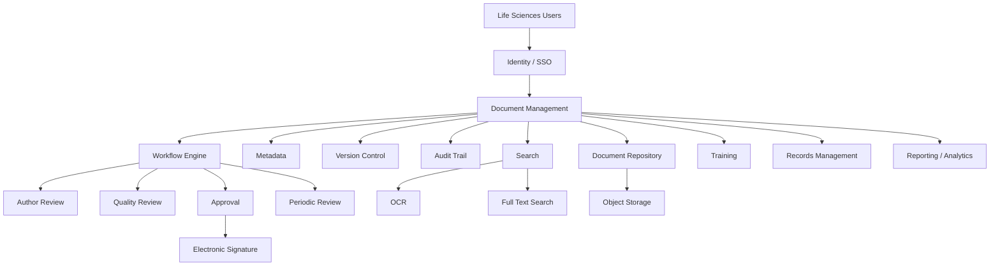
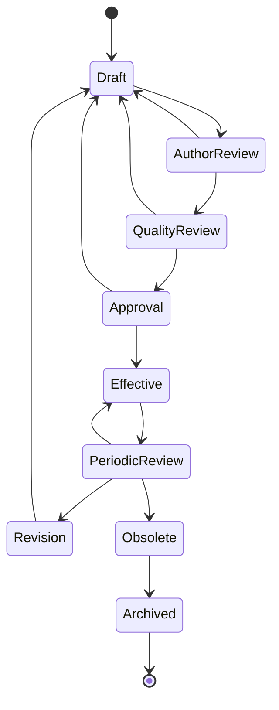
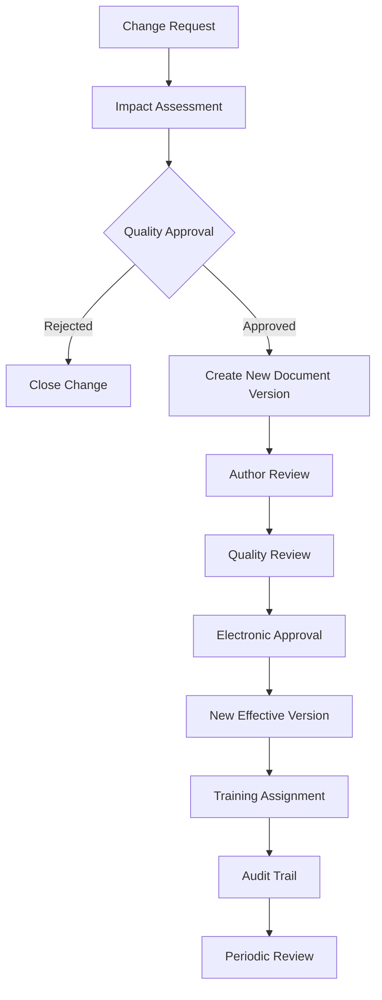

# Awesome-Life-Sciences-Document-Management

# 🧬 Top Life Sciences Document Management


> A curated list of **Life Sciences Document Management Systems (DMS), GxP document control platforms, regulated content management systems, electronic quality management systems and open-source software** for pharmaceutical, biotechnology, medical-device, diagnostics and other regulated organizations.


Life Sciences Document Management sits at the intersection of **Enterprise Content Management (ECM), Document Management, Quality Management and GxP compliance**.


Typical capabilities include:


* Controlled documents

* SOP management

* Work instructions

* Policies and procedures

* Document authoring

* Version control

* Review and approval workflows

* Electronic signatures

* Audit trails

* Controlled copies

* Effective-date management

* Periodic review

* Training assignment

* Change control

* Document obsolescence

* Quality records

* Regulatory submissions

* Clinical documentation

* Manufacturing documentation

* Supplier documentation

* Inspection readiness


This repository focuses primarily on **open-source and self-hostable building blocks**, while maintaining a separate list of commercial platforms such as Veeva Vault QualityDocs, MasterControl Documents, OpenText Documentum, Qualio, Scilife, Sparta TrackWise, ComplianceQuest, Dot Compliance, Ennov DMS and AMPLEXOR.


> **Important:** There is no widely adopted open-source drop-in replacement for a validated commercial GxP DMS such as Veeva QualityDocs or MasterControl. Instead, an open-source implementation generally combines a document-management platform with workflow, identity, audit logging, electronic signatures, records management, quality processes and validation controls.


---


## 📑 Table of Contents


* [☁️ SaaS/Hosted Platforms](#️-saashosted-platforms)

* [🌍 Open-Source](#-open-source)

* [📚 Open-Source Document Management Systems](#-open-source-document-management-systems)

* [🧬 Open-Source Life Sciences & Laboratory Platforms](#-open-source-life-sciences--laboratory-platforms)

* [🧪 Open-Source ELN / Research Documentation](#-open-source-eln--research-documentation)

* [🗂️ Open-Source Enterprise Content Management](#️-open-source-enterprise-content-management)

* [🔄 Open-Source Workflow & Approval](#-open-source-workflow--approval)

* [✍️ Open-Source Electronic Signatures](#️-open-source-electronic-signatures)

* [🔐 Open-Source Identity & Access Control](#-open-source-identity--access-control)

* [📜 Open-Source Audit & Records Management](#-open-source-audit--records-management)

* [🔎 Open-Source OCR & Document Processing](#-open-source-ocr--document-processing)

* [🧬 Open-Source Scientific Data Management](#-open-source-scientific-data-management)

* [🧩 Commercial Platform → Open-Source Equivalent](#-commercial-platform--open-source-equivalent)

* [🏗️ Life Sciences DMS Architecture](#️-life-sciences-dms-architecture)

* [🔄 Open-Source GxP Document Architecture](#-open-source-gxp-document-architecture)

* [📝 Controlled Document Lifecycle](#-controlled-document-lifecycle)

* [⚖️ Commercial vs Open-Source](#️-commercial-vs-open-source)

* [🚀 Recommended Open-Source Stacks](#-recommended-open-source-stacks)

* [📊 Document Management Technology Comparison](#-document-management-technology-comparison)

* [🎯 Recommended Projects by Use Case](#-recommended-projects-by-use-case)

* [🏢 Building a Veeva QualityDocs Alternative](#-building-a-veeva-qualitydocs-alternative)

* [🧪 Building an Open-Source eQMS Document Module](#-building-an-open-source-eqms-document-module)

* [🌐 Open-Source Life Sciences Document Landscape](#-open-source-life-sciences-document-landscape)

* [🧠 Why Open-Source Life Sciences DMS Matters](#-why-open-source-life-sciences-dms-matters)

* [🤝 Contributing](#-contributing)

* [⚠️ Disclaimer](#️-disclaimer)


---


# ☁️ SaaS/Hosted Platforms


Commercial Life Sciences DMS platforms combine document management with regulated workflows, audit trails, electronic signatures, quality processes and validation support.


| Platform                                                                                                 | Company                    | Primary Focus                    | Key Capabilities                                                              |

| -------------------------------------------------------------------------------------------------------- | -------------------------- | -------------------------------- | ----------------------------------------------------------------------------- |

| [Veeva Vault QualityDocs](https://www.veeva.com/products/veeva-qualitydocs/)                             | Veeva                      | GxP content management           | SOPs, controlled documents, workflows, approvals, audit trails, training      |

| [MasterControl Documents](https://www.mastercontrol.com/)                                                | MasterControl              | Quality document management      | Document control, workflows, electronic signatures, training, audit readiness |

| [OpenText Documentum](https://www.opentext.com/products/documentum-content-management-for-life-sciences) | OpenText                   | Enterprise content management    | GxP content, clinical, regulatory, quality and manufacturing content          |

| [Qualio](https://www.qualio.com/)                                                                        | Qualio                     | Life Sciences QMS                | Document control, training, quality workflows and compliance                  |

| [Scilife](https://www.scilife.io/)                                                                       | Scilife                    | Life Sciences QMS                | Document management, training, quality and compliance                         |

| [TrackWise Digital](https://www.sparta-systems.com/)                                                     | Sparta Systems / Honeywell | Enterprise QMS                   | Document control, CAPA, change control, quality processes                     |

| [ComplianceQuest](https://www.compliancequest.com/)                                                      | ComplianceQuest            | QMS / EHS / compliance           | Controlled documents, workflows, audit management, CAPA and compliance        |

| [Dot Compliance](https://www.dotcompliance.com/)                                                         | Dot Compliance             | Cloud eQMS                       | Document management, training, quality workflows and compliance               |

| [Ennov DMS](https://www.ennov.com/)                                                                      | Ennov                      | Life Sciences content management | Document management, workflows, regulatory and quality content                |

| [AMPLEXOR](https://www.amplexor.com/)                                                                    | AMPLEXOR                   | Regulated content management     | Document management, regulatory content, localization and compliance          |

| [MasterControl Quality Excellence](https://www.mastercontrol.com/quality-management-software/)           | MasterControl              | eQMS                             | Documents, training, CAPA, change control and audits                          |

| [Veeva Vault QMS](https://www.veeva.com/products/vault-qms/)                                             | Veeva                      | Enterprise quality management    | Quality events, CAPA, change control and document-centric quality             |

| [ETQ Reliance](https://www.etq.com/)                                                                     | ETQ                        | Enterprise QMS                   | Document control, CAPA, audits and training                                   |

| [Greenlight Guru](https://www.greenlight.guru/)                                                          | Greenlight Guru            | Medical-device QMS               | Design controls, document management, CAPA and quality processes              |

| [QT9 QMS](https://qt9qms.com/)                                                                           | QT9                        | Quality management               | Document control, CAPA, training and audits                                   |

| [SimplerQMS](https://www.simplerqms.com/)                                                                | SimplerQMS                 | Cloud QMS                        | Document control, training, CAPA, change management                           |

| [Qualsys](https://www.qualsys.co.uk/)                                                                    | Qualsys                    | Quality management               | Document control, quality workflows, training and audits                      |


Veeva describes QualityDocs as a regulated quality-content-management solution that manages content through its lifecycle, including procedures, policies, work instructions, quality agreements and batch-related documentation.


OpenText similarly positions Documentum Content Management for Life Sciences around GxP-compliant content spanning clinical, regulatory, quality and manufacturing domains, with audit trails, e-signatures and controlled workflows.


---


# 🌍 Open-Source


The open-source ecosystem is broader than simply "open-source Veeva."


A complete open implementation can be assembled from several layers:


```text

                         LIFE SCIENCES DMS

                                │

        ┌───────────────────────┼────────────────────────┐

        │                       │                        │

        ▼                       ▼                        ▼

   Document DMS            Workflow Engine          Identity

        │                       │                        │

        ▼                       ▼                        ▼

   Mayan EDMS             Camunda / Temporal        Keycloak

   Alfresco               ProcessMaker

   Paperless-ngx

        │

        ├──────────────────────────────────────────────┐

        ▼                                              ▼

   Audit / Records                              E-Signatures

        │                                              │

        ▼                                              ▼

   PostgreSQL / Logs                            Signature Service

        │

        ▼

   OCR / Search / Metadata

```


The strongest open-source options are generally **component platforms**, rather than turnkey validated GxP products.


---


# 📚 Open-Source Document Management Systems


## ⭐ Mayan EDMS


[Mayan EDMS](https://gitlab.com/mayan-edms/mayan-edms) is one of the most relevant open-source DMS projects for building a self-hosted controlled-document environment.


Capabilities include:


* Document management

* Metadata indexing

* Versioning

* OCR

* Document workflows

* Access control

* Digital-signature verification

* Document types

* Tags

* Search

* Audit-oriented features


The project describes itself as a free and open-source enterprise-grade electronic document management system, with document controls, workflows and self-hosting.


| Project                                                                           | Primary Role                  |                  Open Source                 |

| --------------------------------------------------------------------------------- | ----------------------------- | :------------------------------------------: |

| [Mayan EDMS](https://gitlab.com/mayan-edms/mayan-edms)                            | Enterprise DMS                |                       ✅                      |

| [Paperless-ngx](https://github.com/paperless-ngx/paperless-ngx)                   | Document archive / DMS        |                       ✅                      |

| [Alfresco Community Edition](https://github.com/Alfresco/alfresco-community-repo) | Enterprise content management |                       ✅                      |

| [Nuxeo](https://github.com/nuxeo/nuxeo)                                           | Content management platform   |               ⚠️ See licensing               |

| [LogicalDOC Community](https://github.com/logicaldoc/community)                   | DMS                           |               ⚠️ See licensing               |

| [Docspell](https://github.com/eikek/docspell)                                     | Personal / organizational DMS |                       ✅                      |

| [Teedy](https://github.com/sismics/docs)                                          | Lightweight DMS               |                       ✅                      |

| [Papermerge](https://github.com/papermerge/papermerge-core)                       | Document management           |                       ✅                      |

| [SeedDMS](https://github.com/seedDMS/SeedDMS)                                     | Enterprise DMS                |                       ✅                      |

| [OpenKM](https://github.com/openkm/document-management-system)                    | DMS                           | ⚠️ Historical OSS; current CE is binary-only |

| [OpenDocMan](https://github.com/opendocman/opendocman)                            | Document management           |                       ✅                      |


### Important OpenKM Licensing Note


OpenKM should **not** be treated as a straightforward current open-source alternative.


Its repository states that versions prior to 7.0 retain GPLv2 source availability, while from version 7.0 the Community Edition is distributed as a free binary without source code.


Therefore:


```text

OpenKM ≤ 6.x

    → Historical GPL source


OpenKM 7+

    → Free Community binary

    → Not equivalent to current source-available OSS

```


---


# 📂 Open-Source Document Management Comparison


| Project           | DMS | Versioning | OCR | Workflow | Audit Features | Self-Host |

| ----------------- | :-: | :--------: | :-: | :------: | :------------: | :-------: |

| **Mayan EDMS**    |  ✅  |      ✅     |  ✅  |     ✅    |        ✅       |     ✅     |

| **Alfresco CE**   |  ✅  |      ✅     |  ⚠️ |     ✅    |        ✅       |     ✅     |

| **Paperless-ngx** |  ✅  |      ✅     |  ✅  |    ⚠️    |        ✅       |     ✅     |

| **Docspell**      |  ✅  |      ✅     |  ✅  |    ⚠️    |       ⚠️       |     ✅     |

| **Teedy**         |  ✅  |      ✅     |  ✅  |    ⚠️    |       ⚠️       |     ✅     |

| **Papermerge**    |  ✅  |      ✅     |  ✅  |    ⚠️    |       ⚠️       |     ✅     |

| **SeedDMS**       |  ✅  |      ✅     |  ⚠️ |     ✅    |        ✅       |     ✅     |

| **OpenDocMan**    |  ✅  |      ✅     |  ⚠️ |    ⚠️    |       ⚠️       |     ✅     |


Paperless-ngx includes document history/audit logging, while its documentation specifically warns that certain PDF modifications can invalidate existing digital signatures.


---


# 🧬 Open-Source Life Sciences & Laboratory Platforms


Life Sciences document control often needs to connect to:


* ELNs

* LIMS

* Sample management

* Laboratory equipment

* Research records

* Quality systems

* Scientific datasets


Useful open-source projects include:


| Project                                                      | Primary Focus                     | Relevance                                 |

| ------------------------------------------------------------ | --------------------------------- | ----------------------------------------- |

| [eLabFTW](https://github.com/elabftw/elabftw)                | Electronic laboratory notebook    | Experiments / controlled research records |

| [openBIS](https://openbis.ch/)                               | Scientific data management        | Research data / metadata                  |

| [SENAITE](https://github.com/senaite/senaite.lims)           | Laboratory information management | LIMS                                      |

| [openLIMS](https://github.com/Open-LIMS)                     | Laboratory information management | LIMS ecosystem                            |

| [OpenSpecimen](https://github.com/openspecimen/openspecimen) | Biospecimen management            | Research / biobanking                     |

| [LabKey Server](https://github.com/LabKey)                   | Scientific data platform          | Research data                             |

| [Galaxy](https://github.com/galaxyproject/galaxy)            | Scientific workflow platform      | Bioinformatics                            |

| [Nextflow](https://github.com/nextflow-io/nextflow)          | Scientific workflows              | Reproducibility                           |

| [OpenRefine](https://github.com/OpenRefine/OpenRefine)       | Data cleaning                     | Scientific data curation                  |


---


# 🧪 Open-Source ELN / Research Documentation


## eLabFTW


[eLabFTW](https://github.com/elabftw/elabftw) is a major open-source electronic lab notebook for research teams.


Features include:


* Experimental records

* Resource databases

* Reagents

* Equipment

* Cell lines

* File attachments

* Advanced permissions

* REST API

* Timestamping

* Scientific file formats

* Audit-oriented functionality

* Self-hosting


The project explicitly describes itself as a secure electronic lab notebook and supports multi-team installations, REST APIs, advanced permissions and timestamping.


It is particularly relevant when a Life Sciences DMS needs to manage the relationship between:


```text

Experiment

   │

   ├── Raw Data

   ├── Protocol

   ├── Results

   ├── Reagents

   ├── Equipment

   └── Researcher

```


and controlled organizational documentation.


---


## openBIS


[openBIS](https://openbis.ch/) provides open scientific data-management infrastructure.


It is useful for:


* Research data

* Scientific metadata

* Sample tracking

* Experimental data

* Data organization

* Scientific workflows


---


## SENAITE


[SENAITE](https://github.com/senaite/senaite.lims) is an open-source LIMS platform.


It can complement a DMS by connecting controlled documentation to:


```text

Samples

  │

  ▼

Tests

  │

  ▼

Results

  │

  ▼

Laboratory Records

  │

  ▼

Controlled Documents

```


---


# 🗂️ Open-Source Enterprise Content Management


| Project                                                                   | Strength                        |

| ------------------------------------------------------------------------- | ------------------------------- |

| [Alfresco Community](https://github.com/Alfresco/alfresco-community-repo) | Enterprise content management   |

| [Nuxeo](https://github.com/nuxeo/nuxeo)                                   | Content services                |

| [Mayan EDMS](https://gitlab.com/mayan-edms/mayan-edms)                    | Document control                |

| [SeedDMS](https://github.com/seedDMS/SeedDMS)                             | Traditional document management |

| [Paperless-ngx](https://github.com/paperless-ngx/paperless-ngx)           | Document archive / OCR          |

| [Docspell](https://github.com/eikek/docspell)                             | Searchable document management  |

| [Papermerge](https://github.com/papermerge/papermerge-core)               | OCR-centric DMS                 |

| [Teedy](https://github.com/sismics/docs)                                  | Lightweight document management |


For a regulated environment, enterprise content platforms such as Alfresco or Mayan EDMS generally provide a more useful starting point than consumer-oriented document archives.


---


# 🔄 Open-Source Workflow & Approval


Controlled documents require lifecycle workflows.


Typical lifecycle:


```text

Draft

  │

  ▼

Author Review

  │

  ▼

Quality Review

  │

  ▼

Approval

  │

  ▼

Effective

  │

  ▼

Periodic Review

  │

  ├───────────────┐

  │               │

  ▼               ▼

Revision       Obsolete

  │

  ▼

New Version

```


Useful workflow engines:


| Project                                                      | Workflow Capability            |

| ------------------------------------------------------------ | ------------------------------ |

| [Camunda](https://github.com/camunda/camunda)                | BPMN / workflow automation     |

| [Flowable](https://github.com/flowable/flowable-engine)      | BPMN / case / workflow         |

| [Temporal](https://github.com/temporalio/temporal)           | Durable workflow orchestration |

| [ProcessMaker](https://github.com/ProcessMaker/processmaker) | Business process automation    |

| [n8n](https://github.com/n8n-io/n8n)                         | Workflow automation            |

| [Apache Airflow](https://github.com/apache/airflow)          | Data workflow orchestration    |

| [Mayan EDMS](https://gitlab.com/mayan-edms/mayan-edms)       | Document workflows             |


For regulated document control, BPMN-oriented platforms such as Camunda or Flowable can be useful for implementing explicit approval-state machines.


---


# ✍️ Open-Source Electronic Signatures


Electronic signatures are a critical component of regulated document workflows.


Potential building blocks include:


| Project                                                     | Role                                               |

| ----------------------------------------------------------- | -------------------------------------------------- |

| [OpenSignature](https://github.com/OpenSignature)           | Open-source signature ecosystem                    |

| [LibreSign](https://github.com/LibreSign/libresign)         | Electronic signature for Nextcloud                 |

| [DocuSeal](https://github.com/docusealco/docuseal)          | Self-hosted document signing                       |

| [Open eSignForms](https://github.com/mihaip/openesignforms) | Electronic forms/signatures                        |

| [DSS](https://github.com/esig/dss)                          | Digital Signature Services / EU signature tooling  |

| [Nextcloud](https://github.com/nextcloud/server)            | Collaboration platform with signature integrations |


### Important distinction


A cryptographic digital signature and a **regulated electronic signature process** are not automatically equivalent.


A GxP environment may also require:


```text

Identity Verification

        +

Authentication

        +

Signature Intent

        +

Signature Meaning

        +

Timestamp

        +

Audit Trail

        +

Record Binding

        +

Access Controls

```


---


# 🔐 Open-Source Identity & Access Control


A controlled-document system needs granular access control.


Useful projects:


| Project                                                       | Role                            |

| ------------------------------------------------------------- | ------------------------------- |

| [Keycloak](https://github.com/keycloak/keycloak)              | Identity / SSO / RBAC           |

| [Authentik](https://github.com/goauthentik/authentik)         | Identity provider               |

| [Open Policy Agent](https://github.com/open-policy-agent/opa) | Policy engine                   |

| [Casbin](https://github.com/casbin/casbin)                    | Authorization                   |

| [Authelia](https://github.com/authelia/authelia)              | Authentication / access control |

| [Dex](https://github.com/dexidp/dex)                          | OpenID Connect identity         |


A regulated DMS can use:


```text

Keycloak

   │

   ├── SSO

   ├── MFA

   ├── Roles

   ├── Groups

   └── Identity Federation

        │

        ▼

    DMS / QMS

```


---


# 📜 Open-Source Audit & Records Management


A Life Sciences DMS needs strong traceability.


Important events include:


```text

Document Created

      │

      ▼

Document Modified

      │

      ▼

Version Created

      │

      ▼

Review Started

      │

      ▼

Reviewer Action

      │

      ▼

Approval

      │

      ▼

Effective Date

      │

      ▼

Training

      │

      ▼

Periodic Review

      │

      ▼

Revision / Obsolescence

```


Useful infrastructure:


| Technology            | Purpose                 |

| --------------------- | ----------------------- |

| PostgreSQL            | Transactional records   |

| OpenSearch            | Search / audit analysis |

| Elasticsearch         | Search / logging        |

| Loki                  | Log aggregation         |

| Grafana               | Monitoring              |

| Prometheus            | Metrics                 |

| OpenTelemetry         | Distributed telemetry   |

| WORM storage          | Records retention       |

| MinIO                 | Object storage          |

| S3-compatible storage | Document retention      |


---


# 🔎 Open-Source OCR & Document Processing


Controlled documents may originate as:


* PDFs

* Scanned SOPs

* Certificates

* Supplier records

* Batch documentation

* Quality records

* Regulatory documents


Useful projects:


| Project                                                         | Primary Function           |

| --------------------------------------------------------------- | -------------------------- |

| [Tesseract](https://github.com/tesseract-ocr/tesseract)         | OCR                        |

| [PaddleOCR](https://github.com/PaddlePaddle/PaddleOCR)          | OCR / document parsing     |

| [OCRmyPDF](https://github.com/ocrmypdf/OCRmyPDF)                | Searchable PDF OCR         |

| [Docling](https://github.com/docling-project/docling)           | Document parsing           |

| [Surya](https://github.com/datalab-to/surya)                    | OCR / layout analysis      |

| [Unstructured](https://github.com/Unstructured-IO/unstructured) | Document parsing           |

| [Apache Tika](https://github.com/apache/tika)                   | Text / metadata extraction |

| [PyMuPDF](https://github.com/pymupdf/PyMuPDF)                   | PDF processing             |


Example pipeline:


```text

Scanned SOP

    │

    ▼

OCRmyPDF / PaddleOCR

    │

    ▼

OCR Text

    │

    ▼

Metadata Extraction

    │

    ▼

Document Repository

    │

    ▼

Search / Classification

```


---


# 🧬 Open-Source Scientific Data Management


Document management in Life Sciences increasingly intersects with scientific data.


| Project                                                      | Area                              |

| ------------------------------------------------------------ | --------------------------------- |

| [openBIS](https://openbis.ch/)                               | Scientific data management        |

| [eLabFTW](https://github.com/elabftw/elabftw)                | ELN                               |

| [SENAITE](https://github.com/senaite/senaite.lims)           | LIMS                              |

| [OpenSpecimen](https://github.com/openspecimen/openspecimen) | Biospecimen management            |

| [LabKey](https://github.com/LabKey)                          | Scientific data                   |

| [Galaxy](https://github.com/galaxyproject/galaxy)            | Bioinformatics workflows          |

| [Nextflow](https://github.com/nextflow-io/nextflow)          | Reproducible scientific workflows |


This enables an architecture such as:


```text

                  Research

                     │

        ┌────────────┼────────────┐

        ▼            ▼            ▼

       ELN          LIMS       Scientific Data

        │            │            │

        └────────────┼────────────┘

                     ▼

               Document System

                     │

                     ▼

                Quality System

```


---


# 🧩 Commercial Platform → Open-Source Equivalent


| Commercial Platform                   | Open-Source Equivalent / Building Blocks                                           |

| ------------------------------------- | ---------------------------------------------------------------------------------- |

| **Veeva Vault QualityDocs**           | Mayan EDMS + Camunda/Flowable + Keycloak + PostgreSQL + electronic-signature layer |

| **MasterControl Documents**           | Mayan EDMS + workflow engine + Keycloak + audit infrastructure                     |

| **OpenText Documentum Life Sciences** | Alfresco CE / Mayan EDMS + workflow + records management + OpenSearch              |

| **Qualio**                            | Mayan EDMS + workflow + Keycloak + e-signature + training module                   |

| **Scilife**                           | Mayan EDMS + eLabFTW + workflow + identity + audit infrastructure                  |

| **Sparta TrackWise**                  | Mayan EDMS + Camunda + PostgreSQL + quality-process modules                        |

| **ComplianceQuest**                   | Mayan EDMS + workflow + ERP/QMS modules + Keycloak                                 |

| **Dot Compliance**                    | Mayan EDMS + workflow + e-signature + audit layer                                  |

| **Ennov DMS**                         | Mayan EDMS / Alfresco + workflow + records management                              |

| **AMPLEXOR**                          | Alfresco + OpenSearch + workflow + localization/content tooling                    |

| **Veeva QualityDocs + ELN**           | Mayan EDMS + eLabFTW + workflow + identity                                         |

| **Documentum + LIMS**                 | Alfresco + SENAITE + OpenSearch                                                    |

| **Life Sciences DMS**                 | Mayan EDMS + Camunda + Keycloak + PostgreSQL                                       |

| **GxP Document Control**              | Mayan EDMS + workflow + audit log + e-signature                                    |

| **Regulated Content Repository**      | Alfresco + OpenSearch + MinIO + Keycloak                                           |


---


# 🏗️ Life Sciences DMS Architecture





---


# 🔄 Open-Source GxP Document Architecture


```text

                       LIFE SCIENCES USER

                              │

                              ▼

                         KEYCLOAK / SSO

                              │

                              ▼

                     ┌───────────────────┐

                     │    MAYAN EDMS     │

                     │ / ALFRESCO / DMS  │

                     └─────────┬─────────┘

                               │

            ┌──────────────────┼──────────────────┐

            ▼                  ▼                  ▼

       Document Store      Metadata           Versioning

            │                  │                  │

            └──────────────────┼──────────────────┘

                               ▼

                        WORKFLOW ENGINE

                         Camunda / Flowable

                               │

              ┌────────────────┼────────────────┐

              ▼                ▼                ▼

           Review           Approval         Training

              │                │

              └────────────────┘

                       │

                       ▼

                 E-SIGNATURE

                       │

                       ▼

                  AUDIT TRAIL

                       │

                       ▼

                RECORDS RETENTION

```


---


# 📝 Controlled Document Lifecycle


A typical controlled-document lifecycle can be represented as:





Typical document states:


```text

Draft

  ↓

In Review

  ↓

Quality Review

  ↓

Approved

  ↓

Effective

  ↓

Periodic Review

  ↓

Revised / Obsolete

  ↓

Archived

```


---


# 🔐 Controlled Document Security Model


```text

                         DOCUMENT

                            │

             ┌──────────────┼──────────────┐

             ▼              ▼              ▼

           Role          Department      Product

             │              │              │

             └──────────────┼──────────────┘

                            ▼

                     Authorization

                            │

             ┌──────────────┼──────────────┐

             ▼              ▼              ▼

           Read           Review          Approve

             │              │              │

             └──────────────┼──────────────┘

                            ▼

                       Audit Trail

```


---


# 📚 Document Types in Life Sciences


A comprehensive DMS can manage:


| Category       | Examples                             |

| -------------- | ------------------------------------ |

| Quality        | SOPs, policies, quality manuals      |

| Manufacturing  | Batch records, work instructions     |

| Clinical       | Study documents, protocols           |

| Regulatory     | Submission documents                 |

| Laboratory     | Methods, procedures, specifications  |

| Supplier       | Supplier qualification documents     |

| Validation     | Validation plans, protocols, reports |

| Engineering    | Equipment procedures                 |

| Safety         | Safety procedures, risk assessments  |

| Training       | Training materials, curricula        |

| HR             | Controlled personnel procedures      |

| IT             | Computer-system procedures           |

| Data Integrity | Policies and controls                |

| CAPA           | Investigation documents              |

| Change Control | Change requests and assessments      |


---


# 🧠 Document Control Data Model


A useful open-source implementation can model:


```text

Document

│

├── Document ID

├── Title

├── Type

├── Department

├── Product

├── Site

├── Version

├── Status

├── Effective Date

├── Review Date

├── Owner

├── Approvers

├── Related Training

├── Related CAPA

├── Related Change Control

├── Related Risk

├── Attachments

├── Audit Trail

└── Signatures

```


Relationships:


```text

                 Document

                    │

       ┌────────────┼────────────┐

       ▼            ▼            ▼

    Training       CAPA       Change Control

       │            │            │

       └────────────┼────────────┘

                    ▼

                  Audit

```


---


# ⚖️ Commercial vs Open-Source


| Capability              | Commercial Life Sciences DMS           | Open-Source Stack            |

| ----------------------- | -------------------------------------- | ---------------------------- |

| Document Repository     | ✅                                      | ✅                            |

| Version Control         | ✅                                      | ✅                            |

| Metadata                | ✅                                      | ✅                            |

| Workflow                | ✅                                      | ✅                            |

| Audit Trail             | ✅                                      | ✅                            |

| Electronic Signatures   | ✅                                      | ⚠️ Build / integrate         |

| GxP Configuration       | ✅                                      | Build                        |

| Validation Package      | Usually available                      | Organization responsibility  |

| 21 CFR Part 11 Support  | Product-specific                       | Must validate implementation |

| EU Annex 11 Support     | Product-specific                       | Must validate implementation |

| Training Management     | Usually integrated                     | Build / integrate            |

| CAPA                    | Usually integrated                     | Build / integrate            |

| Change Control          | Usually integrated                     | Build / integrate            |

| Supplier Quality        | Often integrated                       | Build / integrate            |

| Regulatory Content      | Often integrated                       | Build / integrate            |

| LIMS Integration        | ✅                                      | Build / integrate            |

| ELN Integration         | ✅                                      | Build / integrate            |

| Self Hosting            | Varies                                 | ✅                            |

| Source Code             | ❌                                      | Often available              |

| Customization           | Configuration                          | Very High                    |

| Data Ownership          | Vendor-dependent                       | Full control                 |

| Infrastructure          | Managed                                | Self-managed                 |

| Validation              | Vendor materials + customer validation | Customer responsibility      |

| Regulatory Operations   | Vendor-supported                       | Customer responsibility      |

| Vendor Lock-In          | Higher                                 | Lower                        |

| Time to Deploy          | Faster                                 | Slower                       |

| Engineering Requirement | Lower                                  | Higher                       |


---


# 📊 Document Management Technology Comparison


| Project           | DMS | Workflow | OCR |    Versioning    | API | Self-Host |

| ----------------- | :-: | :------: | :-: | :--------------: | :-: | :-------: |

| **Mayan EDMS**    |  ✅  |     ✅    |  ✅  |         ✅        |  ✅  |     ✅     |

| **Alfresco CE**   |  ✅  |     ✅    |  ⚠️ |         ✅        |  ✅  |     ✅     |

| **Paperless-ngx** |  ✅  |    ⚠️    |  ✅  |         ✅        |  ✅  |     ✅     |

| **Docspell**      |  ✅  |    ⚠️    |  ✅  |         ✅        |  ✅  |     ✅     |

| **SeedDMS**       |  ✅  |     ✅    |  ⚠️ |         ✅        |  ⚠️ |     ✅     |

| **Teedy**         |  ✅  |    ⚠️    |  ✅  |         ✅        |  ✅  |     ✅     |

| **Papermerge**    |  ✅  |    ⚠️    |  ✅  |         ✅        |  ⚠️ |     ✅     |

| **eLabFTW**       |  ❌  |    ⚠️    |  ⚠️ | Research records |  ✅  |     ✅     |

| **SENAITE**       |  ❌  |     ✅    |  ⚠️ |    Lab records   |  ✅  |     ✅     |

| **openBIS**       |  ❌  |     ✅    |  ❌  |   Data records   |  ✅  |     ✅     |


---


# 🎯 Recommended Projects by Use Case


| Use Case                         | Recommended Starting Point          |

| -------------------------------- | ----------------------------------- |

| General enterprise DMS           | **Mayan EDMS**                      |

| Open-source controlled documents | **Mayan EDMS**                      |

| Enterprise content management    | **Alfresco Community**              |

| Lightweight DMS                  | **Teedy**                           |

| OCR-heavy document archive       | **Paperless-ngx**                   |

| Scientific laboratory records    | **eLabFTW**                         |

| Laboratory management            | **SENAITE**                         |

| Scientific data management       | **openBIS**                         |

| Workflow orchestration           | **Camunda / Flowable**              |

| Identity / SSO                   | **Keycloak**                        |

| Authorization                    | **OPA / Casbin**                    |

| Electronic signatures            | **DocuSeal / LibreSign**            |

| OCR                              | **Tesseract / PaddleOCR**           |

| PDF OCR                          | **OCRmyPDF**                        |

| Document parsing                 | **Docling**                         |

| Full-text search                 | **OpenSearch**                      |

| Object storage                   | **MinIO**                           |

| Database                         | **PostgreSQL**                      |

| Audit observability              | **OpenTelemetry + Grafana**         |

| Open-source GxP DMS foundation   | **Mayan EDMS + Camunda + Keycloak** |

| Life Sciences research stack     | **eLabFTW + openBIS + Mayan EDMS**  |


---


# 🏢 Building a Veeva QualityDocs Alternative


A Veeva QualityDocs-like architecture can be decomposed into:


```text

                         LIFE SCIENCES COMPANY

                                  │

                                  ▼

                            DMS PORTAL

                                  │

                                  ▼

                         MAYAN EDMS / ALFRESCO

                                  │

              ┌───────────────────┼──────────────────┐

              ▼                   ▼                  ▼

         Document Store        Metadata           Search

              │                   │                  │

              └───────────────────┼──────────────────┘

                                  ▼

                           CAMUNDA / FLOWABLE

                                  │

              ┌───────────────────┼──────────────────┐

              ▼                   ▼                  ▼

            Review             Approval           Training

              │                   │

              └───────────────────┼──────────────────┘

                                  ▼

                            E-SIGNATURE

                                  │

                                  ▼

                             AUDIT TRAIL

                                  │

                                  ▼

                         RECORDS RETENTION

```


### Suggested Components


```text

Document Management → Mayan EDMS / Alfresco

Workflow            → Camunda / Flowable

Identity            → Keycloak

Authorization       → OPA / Casbin

Database             → PostgreSQL

Search               → OpenSearch

Object Storage       → MinIO

OCR                  → Tesseract / PaddleOCR

PDF Processing       → OCRmyPDF / Docling

E-Signature          → DocuSeal / LibreSign

Observability        → OpenTelemetry + Grafana

Research Integration → eLabFTW / openBIS

LIMS                 → SENAITE

```


---


# 🧪 Building an Open-Source eQMS Document Module


A document-control module can be built around:


```text

                         DOCUMENT

                            │

                            ▼

                    Metadata Registry

                            │

                            ▼

                     Version Manager

                            │

                            ▼

                      Workflow Engine

                            │

             ┌──────────────┼──────────────┐

             ▼              ▼              ▼

           Review         Approval       Training

             │              │              │

             └──────────────┼──────────────┘

                            ▼

                       E-Signature

                            │

                            ▼

                        Audit Log

                            │

                            ▼

                    Effective Document

                            │

                            ▼

                    Periodic Review

                            │

                     ┌──────┴──────┐

                     ▼             ▼

                  Revision       Obsolete

```


---


# 🔄 Document Change Control


Controlled document changes can be connected to a change-control system:





---


# 🔗 Document ↔ Quality System Relationships


A mature Life Sciences document platform should not treat documents as isolated files.


```text

                         DOCUMENT

                            │

       ┌────────────────────┼────────────────────┐

       │                    │                    │

       ▼                    ▼                    ▼

     CAPA              Change Control           Risk

       │                    │                    │

       ▼                    ▼                    ▼

  Investigation        Impact Assessment      Assessment

       │                    │                    │

       └────────────────────┼────────────────────┘

                            ▼

                        Approval

                            │

                            ▼

                         Training

```


This is where a DMS begins to evolve toward an **eQMS / Quality Management platform**.


---


# 🌐 Open-Source Life Sciences Document Landscape


```mermaid

mindmap

  root((Life Sciences DMS))

    Document Management

      Mayan EDMS

      Alfresco

      SeedDMS

      Paperless-ngx

      Docspell

      Teedy

      Papermerge

    Scientific Documentation

      eLabFTW

      openBIS

      LabKey

    LIMS

      SENAITE

      OpenLIMS

      OpenSpecimen

    Workflow

      Camunda

      Flowable

      Temporal

      ProcessMaker

    Identity

      Keycloak

      Authentik

      OPA

      Casbin

    E-Signatures

      DocuSeal

      LibreSign

      DSS

    OCR

      Tesseract

      PaddleOCR

      OCRmyPDF

      Docling

    Search

      OpenSearch

      Elasticsearch

      Solr

    Storage

      MinIO

      S3

      PostgreSQL

    Observability

      OpenTelemetry

      Prometheus

      Grafana

    Life Sciences

      GxP

      GLP

      GMP

      GCP

      Quality

      Clinical

      Regulatory

      Manufacturing

```


---


# 🧱 Recommended Open-Source Reference Architecture


```text

┌──────────────────────────────────────────────────────────┐

│                  LIFE SCIENCES USERS                     │

│ QA • QC • Regulatory • Clinical • Manufacturing • R&D    │

└────────────────────────────┬─────────────────────────────┘

                             │

                             ▼

┌──────────────────────────────────────────────────────────┐

│                  KEYCLOAK / SSO                          │

│          MFA • RBAC • Identity Federation                │

└────────────────────────────┬─────────────────────────────┘

                             │

                             ▼

┌──────────────────────────────────────────────────────────┐

│               DOCUMENT MANAGEMENT                        │

│             Mayan EDMS / Alfresco                        │

└────────────────────────────┬─────────────────────────────┘

                             │

             ┌───────────────┼────────────────┐

             ▼               ▼                ▼

        PostgreSQL        OpenSearch        MinIO

             │               │                │

             └───────────────┼────────────────┘

                             ▼

┌──────────────────────────────────────────────────────────┐

│                    WORKFLOW                              │

│               Camunda / Flowable                         │

└────────────────────────────┬─────────────────────────────┘

                             │

             ┌───────────────┼────────────────┐

             ▼               ▼                ▼

          Review          Approval          Training

             │               │                │

             └───────────────┼────────────────┘

                             ▼

┌──────────────────────────────────────────────────────────┐

│                 E-SIGNATURE                              │

│            DocuSeal / LibreSign / DSS                    │

└────────────────────────────┬─────────────────────────────┘

                             │

                             ▼

┌──────────────────────────────────────────────────────────┐

│                 AUDIT / RECORDS                          │

│          Immutable Logs • Retention • Archive            │

└──────────────────────────────────────────────────────────┘

```


---


# 🧠 Why Open-Source Life Sciences DMS Matters


Commercial platforms provide an integrated solution for regulated organizations, but open-source software offers important architectural advantages:


```text

                 Proprietary DMS


              ┌───────────────────┐

              │   Vendor Platform │

              └─────────┬─────────┘

                        │

                   Proprietary

                       APIs

                        │

                        ▼

                   Life Sciences

                    Organization


                 Open-Source Stack


                 Life Sciences

                    Organization

                        │

                        ▼

                  Your DMS Layer

                        │

       ┌────────────────┼────────────────┐

       ▼                ▼                ▼

   Mayan/Alfresco     Camunda          Keycloak

       │                │                │

       └────────────────┼────────────────┘

                        ▼

               Your Infrastructure

```


Advantages include:


* Self-hosting

* Data ownership

* Source-code inspection

* Custom workflows

* Integration flexibility

* Air-gapped deployment possibilities

* Reduced vendor lock-in

* Custom metadata models

* Custom document lifecycles

* Integration with internal systems

* Integration with scientific infrastructure


The trade-off is that the organization must take responsibility for:


* Validation

* Configuration management

* Security

* Infrastructure

* Backup

* Disaster recovery

* Compliance controls

* Electronic-signature implementation

* Audit requirements

* SOPs

* Change management

* Regulatory evidence


---


# 🔬 Life Sciences Open-Source Stack


A practical stack for a research-heavy organization could be:


```text

                     LIFE SCIENCES

                           │

           ┌───────────────┼───────────────┐

           ▼               ▼               ▼

         ELN              LIMS             DMS

      eLabFTW           SENAITE        Mayan EDMS

           │               │               │

           └───────────────┼───────────────┘

                           ▼

                     OPENBIS / LABKEY

                           │

                           ▼

                      DATA PLATFORM

                           │

                           ▼

                       QUALITY

                           │

                           ▼

                     WORKFLOW ENGINE

                           │

                           ▼

                       AUDIT / GxP

```


---


# 🚀 Recommended Open-Source Stacks


## 🏆 1. General Life Sciences Document Management


```text

Mayan EDMS

+

PostgreSQL

+

Keycloak

+

OpenSearch

+

MinIO

+

Camunda

```


Suitable for:


* SOPs

* Policies

* Work instructions

* Quality documents

* Controlled templates

* Review and approval workflows


---


## 🧬 2. Research + Document Management


```text

eLabFTW

+

Mayan EDMS

+

Keycloak

+

PostgreSQL

+

MinIO

+

OpenSearch

```


Useful when experimental records and controlled organizational documents need to coexist.


---


## 🧪 3. Laboratory + Quality


```text

SENAITE

+

eLabFTW

+

Mayan EDMS

+

Camunda

+

Keycloak

```


```text

LIMS

 │

 ▼

Laboratory Results

 │

 ▼

ELN

 │

 ▼

Controlled Documents

 │

 ▼

Quality Workflow

```


---


## 🏭 4. Manufacturing Quality


```text

Mayan EDMS

+

Camunda

+

Keycloak

+

PostgreSQL

+

OpenSearch

+

MinIO

+

ERPNext

```


Useful for:


* SOPs

* Manufacturing procedures

* Work instructions

* Equipment documentation

* Supplier records

* Quality records

* Change management


---


## 📑 5. Documentum-Style Enterprise Content Management


```text

Alfresco

+

OpenSearch

+

Keycloak

+

Camunda

+

MinIO

+

PostgreSQL

```


This is oriented toward large enterprise content repositories rather than laboratory notebooks.


---


## 🔐 6. Regulated Document-Control Foundation


```text

Mayan EDMS

+

Keycloak

+

Camunda

+

DocuSeal / LibreSign

+

PostgreSQL

+

OpenSearch

+

MinIO

+

OpenTelemetry

```


This provides the software building blocks for:


```text

Identity

   +

Authorization

   +

Document Control

   +

Workflow

   +

Electronic Signature

   +

Auditability

   +

Retention

   +

Search

```


---


# 🏢 Commercial → Open-Source Architecture Mapping


```text

                    COMMERCIAL PLATFORM

                           │

       ┌───────────────────┼────────────────────┐

       ▼                   ▼                    ▼

  Document Control     Workflow              Compliance

       │                   │                    │

       ▼                   ▼                    ▼

   Mayan EDMS          Camunda             Custom Layer

       │                   │                    │

       └───────────────────┼────────────────────┘

                           ▼

                    Keycloak / RBAC

                           │

                           ▼

                     Audit System

                           │

                           ▼

                  OpenSearch / Logs

                           │

                           ▼

                       MinIO / S3

```


---


# 🧩 What Cannot Simply Be Replaced by OSS


An open-source DMS can reproduce many **software capabilities** of a commercial platform.


It does not automatically reproduce:


```text

Commercial DMS

     │

     ├── Software

     ├── Validation Package

     ├── Regulatory Expertise

     ├── Compliance Content

     ├── Customer Support

     ├── Implementation Services

     ├── Audit Support

     └── Product Roadmap

```


versus:


```text

Open-Source Stack

     │

     ├── Source Code

     ├── Infrastructure

     ├── Customization

     ├── Integration

     └── Organization-Owned Validation

```


This distinction is especially important in GxP environments.


---


# 🧠 GxP DMS Layer Model


```text

┌──────────────────────────────────────────────┐

│              LIFE SCIENCES APPS              │

│   Quality • Regulatory • Clinical • R&D      │

└──────────────────────┬───────────────────────┘

                       │

┌──────────────────────▼───────────────────────┐

│              DOCUMENT CONTROL                │

│       SOP • WI • Policy • Records             │

└──────────────────────┬───────────────────────┘

                       │

┌──────────────────────▼───────────────────────┐

│                 WORKFLOW                     │

│       Review • Approval • Change Control     │

└──────────────────────┬───────────────────────┘

                       │

┌──────────────────────▼───────────────────────┐

│             ELECTRONIC SIGNATURE             │

│         Identity • Intent • Timestamp        │

└──────────────────────┬───────────────────────┘

                       │

┌──────────────────────▼───────────────────────┐

│                AUDIT TRAIL                   │

│        Who • What • When • Why               │

└──────────────────────┬───────────────────────┘

                       │

┌──────────────────────▼───────────────────────┐

│              RECORDS / RETENTION             │

│          Archive • Retention • Legal Hold    │

└──────────────────────────────────────────────┘

```


---


# 📈 Example Document-Control Metrics


A Life Sciences DMS can expose metrics such as:


| Metric                          | Example                   |

| ------------------------------- | ------------------------- |

| Documents by Status             | Draft / Review / Approved |

| Approval Cycle Time             | Average days              |

| Review Overdue                  | Count                     |

| Documents Expiring              | Count                     |

| Obsolete Documents              | Count                     |

| Training Completion             | Percentage                |

| Approval Bottlenecks            | By department             |

| Document Revisions              | Per document              |

| CAPA-linked Documents           | Count                     |

| Change-Control-linked Documents | Count                     |

| Audit Events                    | Count                     |

| Signature Completion            | Percentage                |


Example analytics architecture:


```text

Document Events

      │

      ▼

Event Stream

      │

      ▼

OpenSearch

      │

      ▼

Grafana

      │

      ├── Approval Time

      ├── Review Backlog

      ├── Overdue Documents

      ├── Training Completion

      └── Audit Activity

```


---


# 🤝 Contributing


Contributions are welcome!


Please consider adding:


* Open-source DMS platforms

* Open-source eQMS projects

* Life Sciences document-management projects

* ELNs

* LIMS

* Scientific data-management systems

* Workflow engines

* Electronic-signature software

* Audit-log infrastructure

* Records-management systems

* OCR engines

* Document-processing systems

* Search engines

* Identity platforms

* Compliance tooling

* GxP-related open-source projects

* Regulatory-data platforms

* Document-control templates

* Validation tooling

* Life Sciences integrations


When adding a project, please clearly distinguish between:


* **Fully open-source**

* **Open-core**

* **Source available**

* **Freeware**

* **Community edition**

* **Commercial software**

* **Open-source component used by a commercial platform**


For regulated software, also verify:


* Current license

* Source availability

* Commercial-use rights

* Audit-trail functionality

* Electronic-signature capabilities

* Validation requirements

* Data-retention capabilities

* Current maintenance status


---


# ⚠️ Disclaimer


This repository is an independent technical curation and is **not affiliated with or endorsed by any company or project listed here**.


Life Sciences document management is a regulated domain. Merely deploying an open-source DMS does **not** make an organization compliant with:


* FDA 21 CFR Part 11

* EU GMP

* EU Annex 11

* GxP

* GLP

* GCP

* GMP

* ISO requirements

* Data-integrity expectations

* Other applicable regulations


Compliance depends on the **entire computerized system**, including:


* Software

* Configuration

* Infrastructure

* Procedures

* Access control

* Validation

* Change management

* Security

* Training

* Electronic signatures

* Audit trails

* Backup and recovery

* Data retention

* Operational controls

* Organizational processes


Commercial platforms such as Veeva QualityDocs explicitly position themselves around controlled GxP content, audit trails, workflows and inspection readiness.


An open-source implementation should therefore be viewed as a **software foundation**, not an automatic regulatory-compliance solution.


Licenses also change over time. For example, OpenKM's current Community Edition is free to use but its source-code distribution model changed starting with version 7.0; older versions retain their historical GPL source availability.


---


## ⭐ Star This Repository


If you are interested in:


* Life Sciences

* GxP

* Document Management

* eQMS

* Quality Management

* Pharmaceutical Software

* Biotechnology Software

* Medical Device Software

* ELN

* LIMS

* Regulatory Technology

* Open-Source Life Sciences

* Digital Quality


consider giving this repository a ⭐ **Star** and contributing new projects.


---


**Last updated: September 2026**
